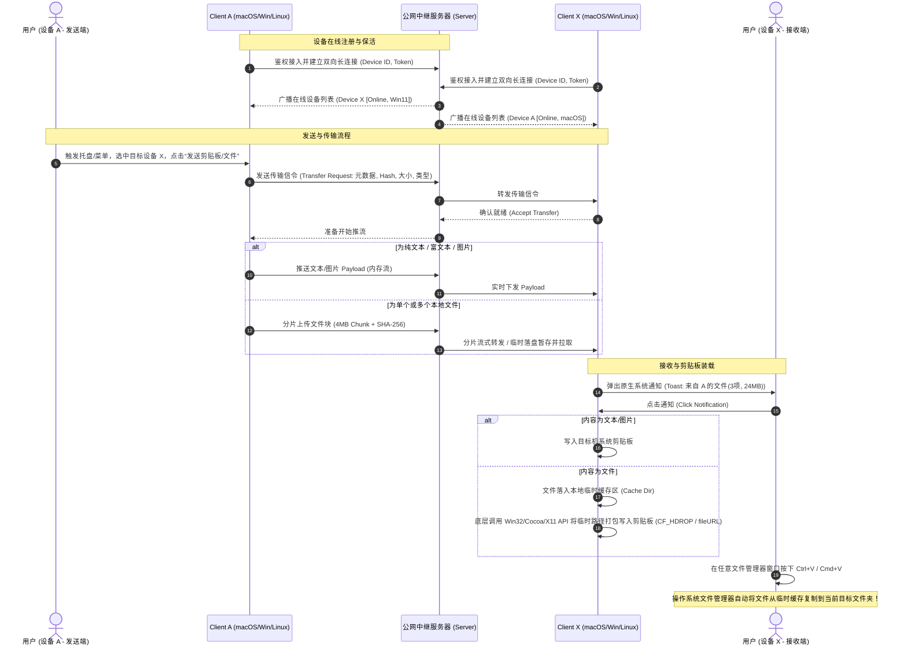
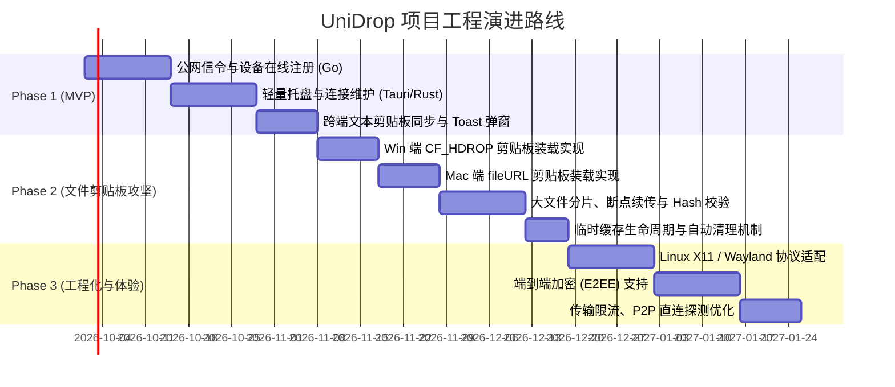

# UniDrop（跨平台剪贴板与文件分发系统）需求规格说明书 (SRS/PRD)

---

## 1. 文档概述

### 1.1 项目背景与定位
**UniDrop**（工程代号亦称 UniClip）是一套专为多主机多系统用户设计的高效、安全、无缝的跨平台剪贴板与文件分发系统。针对现代办公场景下用户在多台不同操作系统（Windows、macOS、Linux）设备之间频繁流转文本、图片和文件的刚需，UniDrop 突破传统文件快传软件“下载至特定隔离目录”的使用割裂感，创新性地将远程数据直接装载入目标机**系统原生剪贴板**，使用户能够享受到“在 A 设备点击发送，在 B 设备任意文件夹直接 `Ctrl+V` / `Cmd+V` 即可落地”的原生级丝滑体验。

### 1.2 核心痛点与对比
| 维度 | 传统工具（如 LocalSend、AirDrop 等） | UniDrop 解决方案 |
| :--- | :--- | :--- |
| **网络环境依赖** | 严重依赖同一局域网（LAN）广播与多播发现；跨网段、办公隔离网、异地多办公场所无法穿透协同。 | 基于轻量公网中继服务器 + 长连接维护，随时随地跨网秒级发现与传输；按需支持 P2P 穿透直连。 |
| **文件落地交互** | 接收端强制落盘至特定“下载目录”；用户必须手动打开该目录、找到文件、再次复制粘贴到工作目标路径。 | **模拟系统文件复制动作**：后台下载到临时缓存后，直接将文件对象/路径注入目标机系统剪贴板，用户在任意资源管理器直接粘贴落盘。 |
| **系统侵入与开销** | 多数基于 Electron 或复杂桌面框架，内存占用高达 150MB~300MB，不适合长驻后台。 | 采用轻量化架构（Tauri + Rust 原生或精简 Go/Rust 守护进程），后台静默常驻内存仅 20~30MB。 |
| **权限与安全性** | 跨公网传输往往需要公网服务器完全解密持久化，存在隐私泄露隐患。 | 文本内存级转发不落盘；文件分片缓存配置严格 TTL 过期清理；支持端到端加密（E2EE）。 |

### 1.3 术语表与定义
* **Client**：运行于各宿主操作系统的客户端程序（常驻托盘守护进程）。
* **Relay Server**：部署于公网的信令与数据中继服务器。
* **Control Plane（控制面）**：通过 WebSocket / gRPC 双向流维系的节点保活、设备发现、传输协商信令通道。
* **Data Plane（数据面）**：处理大文件分片、上传中转、P2P 传输的数据载荷通道。
* **CF_HDROP**：Windows 操作系统用于标识文件拖放与剪贴板文件列表的原生剪贴板格式。
* **fileURL**：macOS Cocoa `NSPasteboard` 用于承载文件系统路径引用的剪贴板类型。
* **text/uri-list**：Linux 桌面（X11/Wayland）标准的 URI 列表 MIME 格式。

---

## 2. 典型业务用例与交互流程



---

## 3. 系统总体架构设计

系统划分为**客户端层（Client）**与**公网中继层（Server）**，实行“控制面与数据面分离”的架构原则。

```
+-----------------------------------------------------------------------------------+
|                                Client A (发送端)                                  |
|  [GUI / 系统托盘]  <-->  [剪贴板捕获器]  <-->  [传输引擎 (分片/限流/加密)]        |
+-----------------------------------------+-----------------------------------------+
                                          |
                        (1) 控制信令 (WSS/gRPC) & (2) 数据通道
                                          |
                                          v
+-----------------------------------------------------------------------------------+
|                             UniDrop 公网服务器 (Server)                            |
|  +---------------------------+  +--------------------------+  +----------------+  |
|  | Device Registry (在线表)  |  | Message Broker(信令路由) |  | Data Relay     |  |
|  | 设备状态/心跳管理/鉴权    |  | 传输握手/设备通知广播   |  | 短数据内存转发 |  |
|  +---------------------------+  +--------------------------+  | 文件分片暂存   |  |
|                                                               +----------------+  |
|  +-----------------------------------------------------------------------------+  |
|  | (可选) STUN / TURN P2P 穿透协商服务                                         |  |
|  +-----------------------------------------------------------------------------+  |
+-----------------------------------------------------------------------------------+
                                          |
                        (1) 控制信令 (WSS/gRPC) & (3) 数据通道
                                          |
                                          v
+-----------------------------------------------------------------------------------+
|                                Client X (接收端)                                  |
|  [传输接收器]  -->  [临时缓存管理(Cache)]  -->  [原生通知服务]  --> [剪贴板注入器] |
|                                                                (Win/Mac/Linux)    |
+-----------------------------------------------------------------------------------+
```

---

## 4. 功能模块详细需求规格

### 4.1 客户端模块（Client Specifications）

#### 4.1.1 系统常驻与托盘交互
* **常驻进程**：无主窗口时在后台低功耗常驻，启动后自动最小化至系统托盘（Windows 通知区、macOS 状态栏 Menu Bar、Linux 系统托盘）。
* **连接状态可视化**：托盘图标需以不同角标或色彩直观反映连接态：
  * *灰色*：离线/未连接公网服务器；
  * *绿色/正常*：已连接且就绪；
  * *蓝色/闪烁*：数据同步/传输中。
* **在线设备展示**：点击托盘图标弹出菜单，毫秒级即时展示当前同账户/同局域下的在线设备，并显示设备别名、系统类型（Windows、macOS、Linux 图标）及网络连通质量。

#### 4.1.2 数据采集模块（发送端）
* **剪贴板监听与读取**：
  * 支持读取系统剪贴板当前格式：纯文本（`UTF-8`）、富文本（`text/html`）、图片格式（`image/png`）。
  * 具备敏感内容过滤（如密码管理器打上了 `Clipboard: Conceal` 标签的文本不主动收集）。
* **文件选取与拖拽**：
  * 托盘快捷菜单内置“选择文件/文件夹...”按钮；
  * 支持悬浮小窗或托盘图标直接接受文件/文件夹拖拽（Drag & Drop）；
  * 文件夹支持深度递归遍历，保留目录树结构打包或流式切片发送。
* **系统上下文集成（进阶扩展）**：
  * Windows：资源管理器右键菜单扩展注册（“通过 UniDrop 发送到...”）；
  * macOS：访达（Finder）快捷操作（Quick Action / Service）；
  * Linux：Nautilus / Dolphin 扩展脚本支持。

#### 4.1.3 传输控制模块
* **大文件分片（Chunking）**：
  * 单文件超过阈值（如 > 4MB）自动执行固定块切片（默认块大小 4MB，可自适应网络调整）；
  * 采用流水线滑动窗口并发上传（支持配置 1~4 并发流）；
  * 每个分片计算独立 MD5/SHA-256，并在整体传输完毕后进行整文件校验，杜绝损坏。
* **断点续传（Resumable Transfer）**：
  * 本地维护传输任务状态数据库（SQLite 或轻量 Key-Value 本地文件）；
  * 因网络波动中断时，重连后可凭 `File-Hash + Task-ID` 查询断点，直接从缺失的 Block 继续传输。
* **传输限流（Rate Limiting）**：
  * 客户端配置界面提供上行/下行速率上限设置（KB/s、MB/s），避免挤占日常网络带宽。

#### 4.1.4 接收与交互模块（接收端）
* **原生系统级通知集成**：
  * 收到传输内容后触发原生 Toast/通知：
    * Windows：WinRT / ToastNotification API；
    * macOS：`UNUserNotificationCenter`；
    * Linux：`org.freedesktop.Notifications` DBus 接口。
  * 通知内容格式样例：“来自 [MacBook-Pro] 的文件 (3个文件, 48.5 MB)”。
* **通知点击动作与策略**：
  * **行为一（默认）**：点击通知，立刻将数据（文本直接推、文件推其临时路径）装载入剪贴板，并在屏幕轻量提示“已复制到剪贴板，请到目标目录 Ctrl+V / Cmd+V”；
  * **行为二（备选配置）**：用户可在设置中开启“点击复制并打开临时目录”，在模拟剪贴板的同时，在文件管理器中唤起并定位该临时目录。
* **本地临时缓存与生命周期管理**：
  * 接收的文件存放于客户端沙盒临时目录：
    * Windows: `%LOCALAPPDATA%\UniDrop\cache`
    * macOS: `~/Library/Caches/UniDrop/cache`
    * Linux: `~/.cache/unidrop/cache`
  * **自动淘汰策略**：
    * **TTL 机制**：文件入库超过设定时间（默认 24 小时）自动删除物理文件；
    * **容量限制**：设定缓存池上限（如 10GB），超出时按 LRU 算法剔除最早未被再次访问的文件；
    * **重启清理选项**：提供“每次客户端关闭/系统重启时清空历史临时文件”的开关。

#### 4.1.5 剪贴板注入核心（平台底层技术实现）
这是本系统的**核心壁垒功能**。为了让用户在目标机按快捷键即可像普通本地复制一样粘贴文件，必须调用底层 OS API 将下载好的临时文件按操作系统要求推入剪贴板：

| 操作系统 | 底层剪贴板格式 / API | 详细技术实现方案与数据组织 |
| :--- | :--- | :--- |
| **Windows** | 剪贴板格式：`CF_HDROP`<br>对应结构体：`DROPFILES` | 1. 分配一块全局共享内存 `GlobalAlloc(GMEM_MOVEABLE, size)` 并加锁；<br>2. 初始化 `DROPFILES` 结构体，其中 `fWide = TRUE`（标识 UTF-16 编码）；<br>3. 在结构体尾部连续追加各文件的绝对物理路径，路径之间用 `\0` 隔开，整个列表末尾以双 `\0\0` 终止；<br>4. 解锁后调用 `OpenClipboard()` -> `EmptyClipboard()` -> `SetClipboardData(CF_HDROP, hGlobal)` -> `CloseClipboard()`；<br>5. 资源管理器收到该剪贴板后，用户按 `Ctrl+V` 会将其解析为标准文件复制命令。 |
| **macOS** | 剪贴板类型：<br>`NSPasteboard.PasteboardType.fileURL`<br>(及旧版 `NSFilenamesPboardType`) | 1. 采用 Objective-C / Swift 与 Rust FFI 交互；<br>2. 获取全局通用剪贴板 `[NSPasteboard generalPasteboard]`；<br>3. 调用 `clearContents` 清空剪贴板；<br>4. 将本地各临时文件绝对路径封装为 `[NSURL fileURLWithPath:path]`；<br>5. 调用 `writeObjects:urls` 写入剪贴板对象池；<br>6. macOS 访达（Finder）感知后，立刻响应 `Cmd+V` 并在当前访达路径执行拷贝。 |
| **Linux (X11)** | MIME 类型：`text/uri-list`<br>Target: `CLIPBOARD` | 1. Linux X11 剪贴板基于 X Selection 请求-响应模型；<br>2. 声明掌控 `CLIPBOARD` 选择区；<br>3. 响应来自文件管理器（如 Nautilus/Thunar）的 `ConvertSelection` 事件；<br>4. 提供 `text/uri-list` 格式数据：多行以 `\r\n` 分隔的 URI，格式如 `file:///tmp/unidrop/cache/test.pdf\r\n`；<br>5. 文件管理器粘贴时读取此 URI 列表并执行拷贝。 |
| **Linux (Wayland)** | 协议扩展：`wl-clipboard` / `wlr-data-control` / XDG Clipboard Portal | 1. Wayland 出于沙箱隔离安全策略，无聚焦的后台程序默认禁止直接写入剪贴板；<br>2. 方案 A（标准）：调用系统已安装的 `wl-copy -t text/uri-list` 管道输入 URI 列表；<br>3. 方案 B（桌面集成）：通过 D-Bus 调用 `org.freedesktop.portal.Clipboard` 提供的代理授权接口。 |

---

### 4.2 服务端模块（Server Specifications）

#### 4.2.1 鉴权认证与设备管理
* **主机安全接入鉴权**：
  * **PSK 模式（轻量自建）**：用户在服务端与各客户端配置统一的预共享密钥（Pre-Shared Key），握手时使用 HMAC 进行身份鉴别；
  * **多租户/令牌模式（商业化扩展）**：基于用户凭据（Username/Password）签发 JWT 访问令牌，支持一个账号绑定多台设备；
* **设备注册表（Device Registry）**：
  * 服务端内存中维护全局会话哈希表 `Map<DeviceID, ClientSession>`；
  * 记录字段：`DeviceID`、`Hostname`、`OS_Type`、`Public_IP`、`Connection_Time`、`Last_Ping_Timestamp`。
* **长连接保活与广播**：
  * 客户端与服务端每 15~30 秒双向 Ping/Pong 心跳；
  * 连续 3 次心跳丢失则判定掉线，服务端从设备表中移除该设备，并向该用户所属其他在线节点组播 `DeviceOffline(DeviceID)` 信令。

#### 4.2.2 信令路由控制面 (Control Plane)
* 负责客户端之间的元数据协商与信令转发：
  * `DeviceListRequest / DeviceListResponse`：获取当前在线设备；
  * `TransferOffer`：A 发送给 X：“准备向你发送 3 个文件，总计 50MB，文件 Hash 为 xxx”；
  * `TransferAnswer`：X 回复 A：“同意接收 / 拒绝 / 仅在特定网络下接收”；
  * `TransferProgress / Complete`：进度上报与状态同步。

#### 4.2.3 数据中继平面 (Data Plane)
* **短文本/剪贴板数据（Memory Relay）**：
  * 纯文本或小图片数据极小（< 5MB），服务端采用基于内存的 Pub/Sub 模式直接通道转发，严禁写入中继服务器磁盘，保障低延迟与隐私安全。
* **大文件数据中继（File Relay）**：
  * **流式中转（Stream Relay）**：若接收端已就绪，服务端作为管道，A 上传 Chunk 的同时直接流水线下发给 X，服务器仅占用几十 KB 内存缓冲，极大降低 VPS 磁盘压力；
  * **离线暂存（TTL Staging - 可选功能）**：若接收端离线或配置了延迟接收，文件分片加密暂存于服务端磁盘，超过指定 TTL（如 2 小时）若接收端未拉取，自动执行物理擦除。
* **NAT 穿透辅助（P2P 直连扩展）**：
  * 服务端内置简易 STUN 服务器，在控制面信令中协助客户端互相获取双方的公网映射 IP/端口；
  * 若双端处于同局域网或锥形 NAT，则自动协商握手切入 WebRTC / UDP / TCP 直连通道，直接规避公网服务器带宽瓶颈。

---

## 5. 协议设计与通信报文规范

### 5.1 传输报文通用结构（Protobuf / JSON 描述）

#### 5.1.1 控制信令报文（Control Envelope）
```json
{
  "version": 1,
  "trace_id": "9f7b1c4e-6e21-4f33-8a9d-114422aabbcc",
  "action": "TRANSFER_OFFER",
  "from_device": "macbook-m1-pro",
  "to_device": "desktop-win11",
  "timestamp": 1773273865,
  "payload": {
    "session_id": "sess_88320491",
    "content_type": "FILE", 
    "summary": {
      "item_count": 2,
      "total_size": 25165824,
      "preview_text": "report.pdf 等2个文件"
    },
    "items": [
      {
        "item_id": "item_1",
        "name": "report.pdf",
        "size": 18874368,
        "is_directory": false,
        "sha256": "e3b0c44298fc1c149afbf4c8996fb92427ae41e4649b934ca495991b7852b855"
      },
      {
        "item_id": "item_2",
        "name": "data.xlsx",
        "size": 6291456,
        "is_directory": false,
        "sha256": "ca978112ca1bbdcafac231b39a23dc4da786eff8147c4e72b9807785afee48bb"
      }
    ]
  }
}
```

#### 5.1.2 分片传输数据帧（Data Chunk Frame）
每个二进制 Chunk 帧在协议层由固定头（Header）与有效载荷（Body）构成：
```
+---------------+---------------+---------------+---------------+
| Magic (2B)    | Version (1B)  | ChunkType(1B) | SessionID(8B) |
+---------------+---------------+---------------+---------------+
| ItemID (4B)   | ChunkIndex(4B)| TotalChunk(4B)| PayloadLen(4B)|
+---------------+---------------+---------------+---------------+
| Checksum (SHA-256 前8字节截断 / CRC32 - 4B)                   |
+---------------------------------------------------------------+
| Payload Binary Data (例如 4MB 原始或加密字节流)               |
+---------------------------------------------------------------+
```

---

## 6. 技术选型评估与建议

### 6.1 服务端（Server）选型建议
* **首选方案：Go (Golang)**
  * *优势*：原生高并发 Goroutine 模型极度适合百万级长连接与网络 IO；交叉编译为单一静态无依赖二进制可执行文件；生态中 gRPC、WebSocket、QUIC 工具链非常成熟。
  * *备选*：Rust（极致性能与内存安全，但异步网络库学习曲线稍陡峭）。

### 6.2 客户端（Client）框架对比与选型决策
| 指标 | 推荐方案：Tauri (Rust + Web前端) | 备选方案：Flutter Desktop | 淘汰方案：Electron |
| :--- | :--- | :--- | :--- |
| **内存占用 (常驻)** | **20MB ~ 35MB** | 40MB ~ 70MB | 150MB ~ 300MB |
| **安装包体积** | **8MB ~ 15MB** | 30MB ~ 50MB | 80MB ~ 120MB+ |
| **底层系统能力调用** | **极佳**。直接在 Rust 代码中调用 `windows-rs` (Win32), `objc2` / `cocoa` (macOS), `x11rb` / `wayland-client` (Linux)。 | **一般**。需写大量 C++ / Objective-C 插件通过 Platform Channel 桥接。 | **较弱**。Native 模块编译与 node-gyp 跨平台维护复杂。 |
| **托盘与后台能力** | 原生级别支持各平台 Tray 行为与无主窗口后台运行。 | 托盘与系统菜单支持相对不够原生（依赖社区包）。 | 支持良好但耗电耗资源。 |

> **决策结论**：**全面推荐使用 Tauri 2.0 (Rust) 开发客户端**。Rust 后端保证了各操作系统底层剪贴板 API 调用的高可靠与零抽象损耗，前端仅在呼出托盘、历史面板或设置时渲染轻量 Webview，关闭即销毁页面上下文，兼顾极致资源占用与现代化界面美观度。

---

## 7. 非功能性需求（NFR）

### 7.1 性能指标
* **端到端延迟**：纯文本/剪贴板数据在双端均在线情况下，从发送端点击到接收端弹出系统通知的公网端到端中继延迟 $\le 300\text{ms}$（国内同地域下 $\le 100\text{ms}$）。
* **托盘响应性**：托盘右键菜单弹出耗时 $\le 50\text{ms}$，无任何界面掉帧或感知卡顿。
* **CPU/内存占用**：静默常驻状态下客户端 CPU 占用率 $< 0.1\%$，内存稳定在 $35\text{MB}$ 以下。

### 7.2 安全与隐私要求
* **通信通道安全**：全量控制信令及数据中继强制启用 TLS 1.3 / WSS，杜绝公网流量被监听篡改。
* **端到端加密（E2EE 规划）**：在 Phase 3 引入基于 `X25519` + `AES-256-GCM` 的端到端加密。设备配对后在本地完成会话密钥协商，公网中继服务器仅能看见加密分片二进制流，无法窃视任何传输内容。
* **防滥用防护**：服务端针对单个 IP 与单个 Device ID 施加防爆破与频控限流策略，非法连接尝试实施封禁。

### 7.3 兼容性矩阵
* **Windows**：Windows 10 1809 及以上、Windows 11（x64、ARM64）；
* **macOS**：macOS 11.0 (Big Sur) 及以上（Apple Silicon M系列及 Intel x86_64）；
* **Linux**：Ubuntu 20.04+、Fedora 36+、Arch Linux 等主流发行版（支持 X11 与 Wayland 桌面环境）。

---

## 8. 实施里程碑与演进路线



### 8.1 阶段目标分解
* **Phase 1（MVP 验证阶段）**：
  * 服务端实现基于 WebSocket 的简单设备鉴权、设备注册表与信令转发；
  * 客户端完成托盘常驻、在线设备列表显示；
  * 打通纯文本/图片剪贴板的发送与接收端系统通知唤起、写入目标剪贴板。
* **Phase 2（文件剪贴板攻坚阶段）**：
  * **核心突破**：彻底实现 Windows（`CF_HDROP`）与 macOS（`NSPasteboard.fileURL`）在通知点击后将下载完成的本地缓存文件注入系统剪贴板，实测在 Explorer/Finder 中成功 `Ctrl+V` / `Cmd+V` 粘贴；
  * 完成文件分片上传中转、并发控制与 SHA-256 完整性校验；
  * 实现本地 Cache 目录的 TTL 与 LRU 自动清理功能。
* **Phase 3（工程化与体验提升）**：
  * 深入攻关 Linux 环境（X11 `text/uri-list` 与 Wayland `wl-clipboard`）；
  * 实现客户端之间端到端加密（E2EE），公网服务器零知识中转；
  * 集成 STUN 实现同局域网/好 NAT 条件下的 P2P 直连传输，节省服务器带宽。

---

## 9. 附录：核心底层剪贴板写入实现参考 (技术预研)

### 9.1 Windows (Rust + windows-rs 核心伪代码)
```rust
// 伪代码参考：构建 DROPFILES 并写入 CF_HDROP
use windows::Win32::System::DataExchange::*;
use windows::Win32::System::Memory::*;
use windows::Win32::UI::Shell::DROPFILES;

pub fn set_clipboard_files_windows(paths: &[std::path::PathBuf]) -> Result<(), Box<dyn std::error::Error>> {
    // 1. 序列化路径列表为 UTF-16，以 \0 分隔，结尾双 \0
    let mut buffer_u16 = Vec::new();
    for p in paths {
        let wide: Vec<u16> = p.as_os_str().encode_wide().chain(std::iter::once(0)).collect();
        buffer_u16.extend(wide);
    }
    buffer_u16.push(0); // 最后的双空字符终止

    let dropfiles_size = std::mem::size_of::<DROPFILES>();
    let total_size = dropfiles_size + buffer_u16.len() * 2;

    unsafe {
        // 2. 分配全局可移动内存块
        let h_global = GlobalAlloc(GMEM_MOVEABLE, total_size)?;
        let p_mem = GlobalLock(h_global) as *mut u8;

        // 3. 填充 DROPFILES 结构体
        let dropfiles = p_mem as *mut DROPFILES;
        (*dropfiles).pFiles = dropfiles_size as u32;
        (*dropfiles).fWide = true.into(); // 使用 Unicode

        // 4. 将路径数据拷贝至结构体之后
        std::ptr::copy_nonoverlapping(
            buffer_u16.as_ptr() as *const u8,
            p_mem.add(dropfiles_size),
            buffer_u16.len() * 2,
        );
        GlobalUnlock(h_global)?;

        // 5. 写入系统剪贴板
        OpenClipboard(None)?;
        EmptyClipboard()?;
        SetClipboardData(CF_HDROP.0 as u32, Some(windows::Win32::Foundation::HANDLE(h_global.0)))?;
        CloseClipboard()?;
    }
    Ok(())
}
```

### 9.2 macOS (Objective-C / Cocoa 核心伪代码)
```objc
// 伪代码参考：将文件路径转换为 NSURL 并写入 NSPasteboard
#import <Cocoa/Cocoa.h>

void SetClipboardFilesMacOS(NSArray<NSString *> *filePaths) {
    NSMutableArray<NSURL *> *fileURLs = [NSMutableArray arrayWithCapacity:filePaths.count];
    for (NSString *path in filePaths) {
        NSURL *url = [NSURL fileURLWithPath:path];
        if (url) {
            [fileURLs addObject:url];
        }
    }
    
    NSPasteboard *pasteboard = [NSPasteboard generalPasteboard];
    [pasteboard clearContents];
    // 写入 fileURL 对象，Finder 和其他 App 识别后即可执行 Cmd+V 拷贝
    [pasteboard writeObjects:fileURLs];
}
```

### 9.3 Linux (X11 / text/uri-list 核心数据格式)
```text
# 发送给 X11 Selection 或 Wayland wl-copy 的格式
file:///home/user/.cache/unidrop/cache/document.pdf\r\n
file:///home/user/.cache/unidrop/cache/screenshot.png\r\n
```
