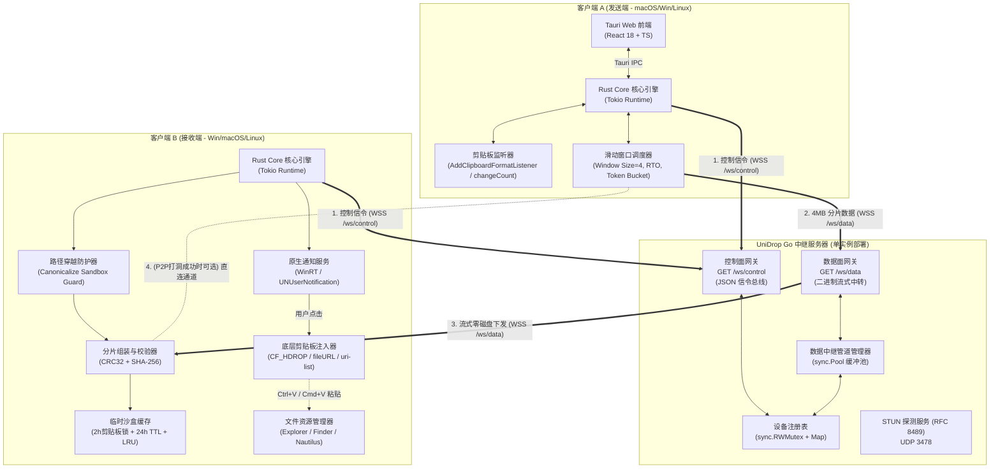
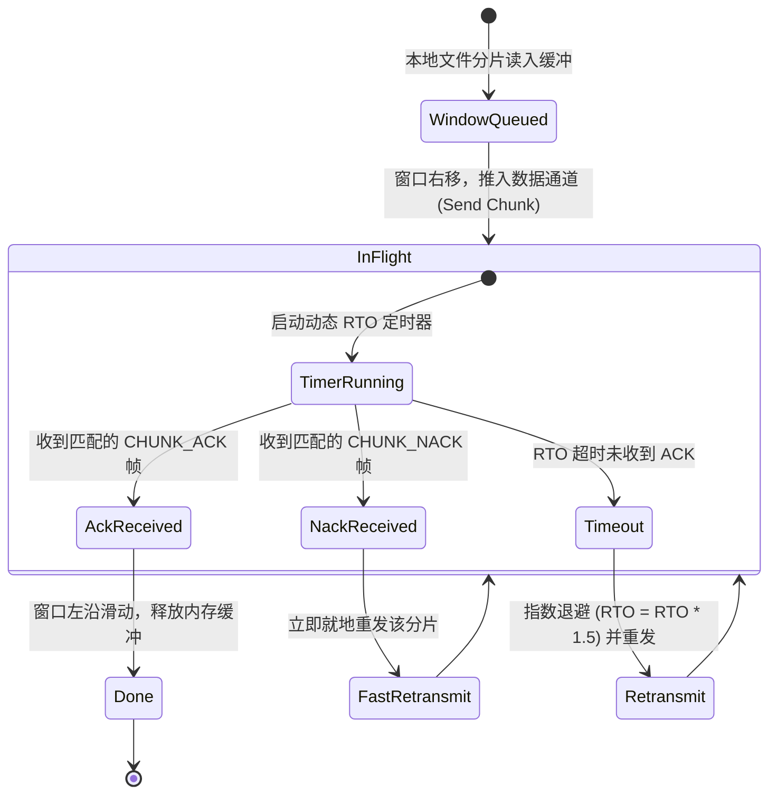
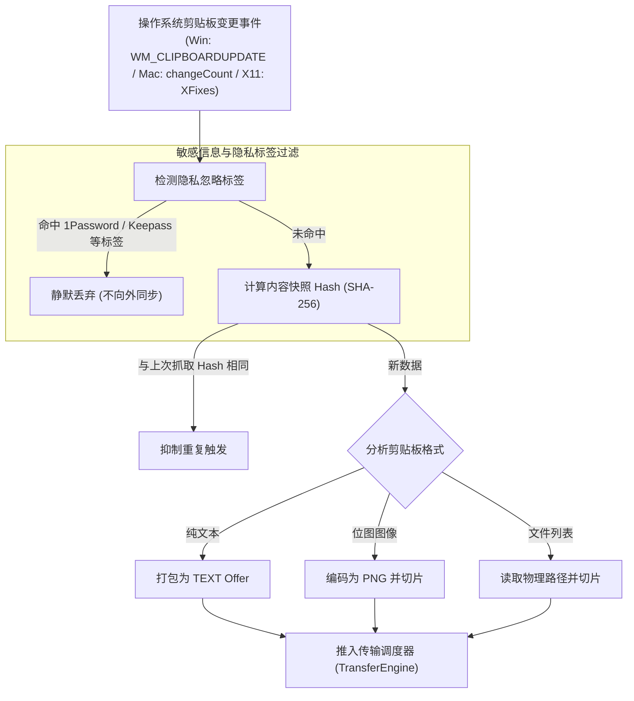
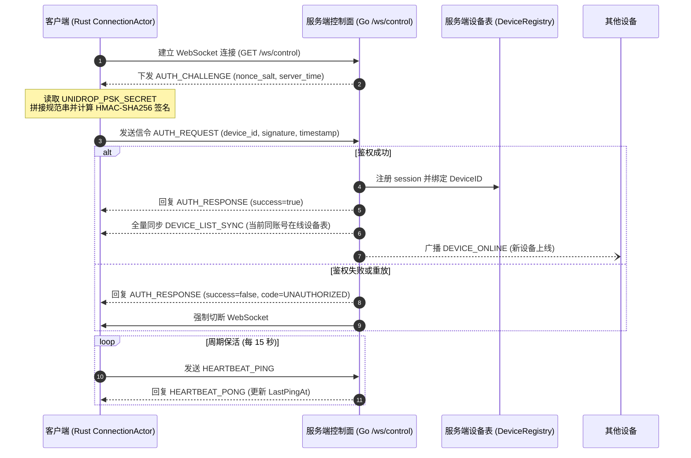
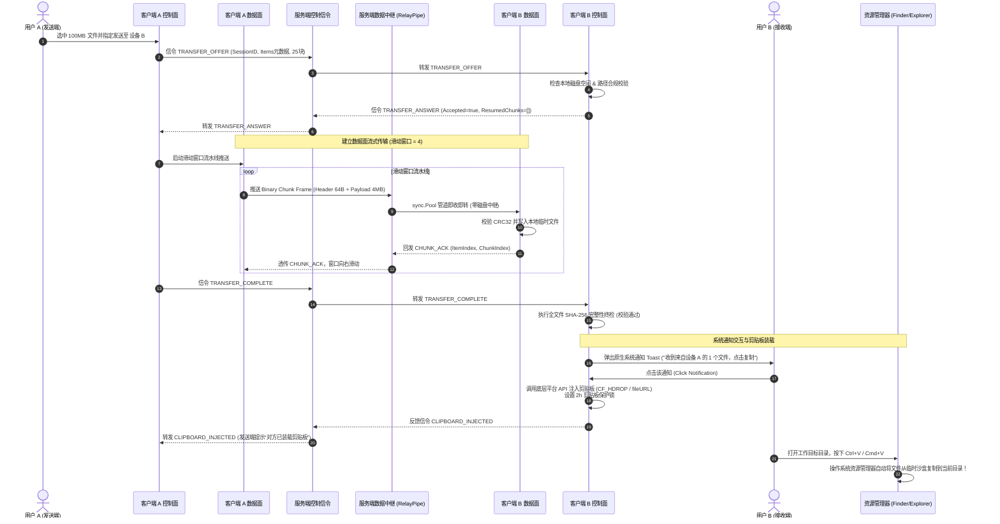
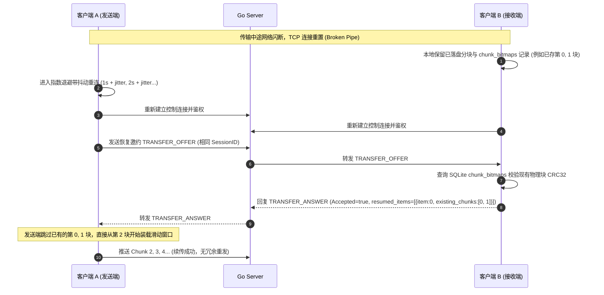
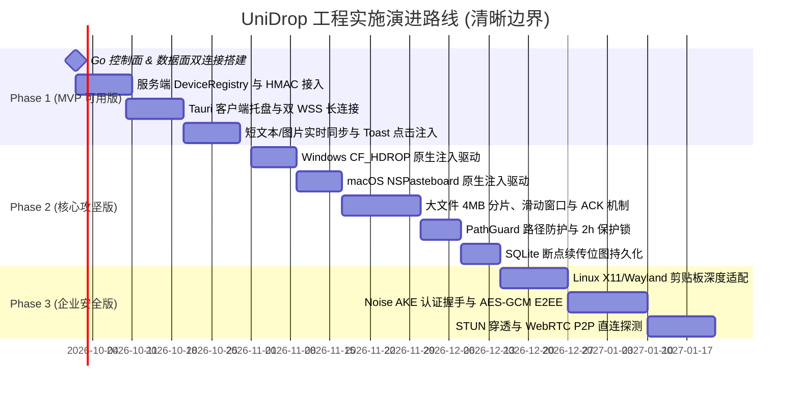

# UniDrop（跨平台剪贴板与文件分发系统）系统详细设计说明书 (LLD / Technical Design Document)

**文档版本**：v1.1.0  
**状态**：Approved / Ready for Implementation (已通过全面设计审查，吸纳 v1.0.0 审查意见并闭环所有 P0~P3 问题)  
**修订日期**：2026-09-11  
**技术选型收敛结论**：
* **服务端**：Go 1.22+（单二进制无依赖守护进程；WebSocket 库收敛为 `github.com/coder/websocket`；双通道架构：WSS 控制面 + 独立 WSS 数据面；`sync.Pool` 内存切片复用零磁盘流式中转）
* **客户端**：Tauri 2.0（Rust 1.78+ 原生核心 + Vite / React 18 / TypeScript / Tailwind CSS Web 前端；主进程常驻 RSS $\le 30\text{MB}$；SQLite 本地持久化；Win32 / Cocoa / X11 底层剪贴板注入与监听驱动）

---

## 目录
- [1. 架构总览与选型收敛决策](#1-架构总览与选型收敛决策)
  - [1.1 核心设计理念与交互定稿](#11-核心设计理念与交互定稿)
  - [1.2 控制面与数据面双通道拓扑图](#12-控制面与数据面双通道拓扑图)
  - [1.3 核心技术栈明确收敛表](#13-核心技术栈明确收敛表)
- [2. 通信协议与数据帧格式规范](#2-通信协议与数据帧格式规范)
  - [2.1 控制信令报文（Control Envelope JSON）](#21-控制信令报文control-envelope-json)
  - [2.2 数据面 64 字节定长帧头（Binary Frame Header）](#22-数据面-64-字节定长帧头binary-frame-header)
  - [2.3 标识映射规范 (SessionID / ItemID)](#23-标识映射规范-sessionid--itemid)
- [3. 可靠数据传输与滑动窗口重传机制 (ARQ)](#3-可靠数据传输与滑动窗口重传机制-arq)
  - [3.1 滑动窗口与 ACK / NACK 闭环设计](#31-滑动窗口与-ack--nack-闭环设计)
  - [3.2 动态 RTO 估算与快速重传](#32-动态-rto-估算与快速重传)
  - [3.3 端到端 SHA-256 校验失败恢复流程](#33-端到端-sha-256-校验失败恢复流程)
- [4. 服务端 (Go) 详细设计与运维硬化](#4-服务端-go-详细设计与运维硬化)
  - [4.1 服务端总体架构与 Goroutine 模型](#41-服务端总体架构与-goroutine-模型)
  - [4.2 设备注册表并发模型 (sync.RWMutex)](#42-设备注册表并发模型-syncrwmutex)
  - [4.3 数据中继管道 (RelayPipe) 生命周期与内存配额保护](#43-数据中继管道-relaypipe-生命周期与内存配额保护)
  - [4.4 接入认证与防重放机制 (HMAC-SHA256)](#44-接入认证与防重放机制-hmac-sha256)
  - [4.5 公网滥用防护与限流策略](#45-公网滥用防护与限流策略)
  - [4.6 可观测性设计 (Prometheus Metrics & Tracing)](#46-可观测性设计-prometheus-metrics--tracing)
- [5. 客户端 (Tauri + Rust) 详细设计](#5-客户端-tauri--rust-详细设计)
  - [5.1 客户端分层架构图与模块协同](#51-客户端分层架构图与模块协同)
  - [5.2 核心壁垒：跨平台原生剪贴板深度装载 (Injection)](#52-核心壁垒跨平台原生剪贴板深度装载-injection)
  - [5.3 发送端系统剪贴板监听驱动 (Capture Engine)](#53-发送端系统剪贴板监听驱动-capture-engine)
  - [5.4 接收端路径安全校验 (严防路径穿越)](#54-接收端路径安全校验-严防路径穿越)
  - [5.5 临时缓存沙盒生命周期与剪贴板锁定保护 (Cache Manager)](#55-临时缓存沙盒生命周期与剪贴板锁定保护-cache-manager)
  - [5.6 本地持久化 SQLite 数据库设计](#56-本地持久化-sqlite-数据库设计)
- [6. 端到端加密 (E2EE) 深度设计](#6-端到端加密-e2ee-深度设计)
  - [6.1 基于设备长期身份密钥的认证密钥协商 (Noise-based AKE)](#61-基于设备长期身份密钥的认证密钥协商-noise-based-ake)
  - [6.2 分块密文 AAD 绑定与抗重放截断](#62-分块密文-aad-绑定与抗重放截断)
  - [6.3 元数据隐私保护策略](#63-元数据隐私保护策略)
- [7. 核心业务完整时序设计](#7-核心业务完整时序设计)
  - [7.1 握手鉴权与设备在线状态维护时序](#71-握手鉴权与设备在线状态维护时序)
  - [7.2 大文件分片流式中继与剪贴板落地全时序 (双泳道)](#72-大文件分片流式中继与剪贴板落地全时序-双泳道)
  - [7.3 断网闪断与断点续传恢复时序](#73-断网闪断与断点续传恢复时序)
- [8. 工程目录结构与部署规范](#8-工程目录结构与部署规范)
  - [8.1 服务端工程代码目录 (Standard Layout)](#81-服务端工程代码目录-standard-layout)
  - [8.2 客户端工程代码目录 (Tauri 2.0)](#82-客户端工程代码目录-tauri-20)
  - [8.3 部署与分发合规规范 (代码签名与公证)](#83-部署与分发合规规范-代码签名与公证)
- [9. 测试验证与验收标准](#9-测试验证与验收标准)
  - [9.1 自动化测试套件](#91-自动化测试套件)
  - [9.2 三平台物理验收准则 (含 Linux)](#92-三平台物理验收准则-含-linux)
- [10. 演进路线与 Phase 边界定义](#10-演进路线与-phase-边界定义)

---

## 1. 架构总览与选型收敛决策

### 1.1 核心设计理念与交互定稿
为彻底消除跨设备文件传输的“下载孤岛”痛点，UniDrop 采用**“远程传输完成 -> 原生系统通知交互 -> 注入系统剪贴板 -> 用户在目标目录 `Ctrl+V` / `Cmd+V` 落地”**的核心链路。

> [!IMPORTANT]
> **交互模型定稿（解决审查 P0-5）**：
> 1. **默认标准交互**：文件或数据接收落盘后，客户端弹出系统原生通知（Toast）。**必须在用户点击通知后**才将数据注入目标机系统剪贴板，并在屏幕轻量弹出浮动提示（“已复制到剪贴板，请到目标目录 Ctrl+V / Cmd+V”）。此设计彻底避免静默覆写用户当前正在使用的剪贴板数据。
> 2. **高级免打扰模式（可选配置）**：用户可在设置中开启“自动静默注入剪贴板”。若开启此项，客户端会自动备份当前剪贴板的文本/图像（维护最近 3 条历史栈），并在注入前检查当前前景窗口是否为文本编辑器，保障数据安全。
> 3. **注入反馈回执**：无论何种模式，注入剪贴板成功后，接收端均向发送端反馈 `CLIPBOARD_INJECTED` 信令，发送端托盘/悬浮窗显示“对方已装载剪贴板”。

### 1.2 控制面与数据面双通道拓扑图
为杜绝数据大二进制流阻塞轻量心跳及控制信令引起的行头阻塞（Head-of-Line Blocking），系统采用**双独立 WebSocket 连接**的体系架构：
* **控制面（Control Plane）**：连接 `/ws/control`，专职传输 JSON 信令（心跳、设备同步、传输协商、ACK/NACK）。
* **数据面（Data Plane）**：连接 `/ws/data`，专职流式传输 64 字节定长头二进制 Chunk 帧。



### 1.3 核心技术栈明确收敛表
针对评审中指出的未决项，在此全部作出确定性收敛（解决审查 P0-6、P2-12）：

| 模块 | 最终收敛技术选型 | 淘汰/替代选项 | 确定理由 |
| :--- | :--- | :--- | :--- |
| **服务端语言** | **Go 1.22+** | Rust / C++ | 静态二进制极简部署，Goroutine 网络并发开销极小。 |
| **服务端 WS 库** | `github.com/coder/websocket` (v1.8.12+) | `nhooyr.io/websocket`<br>`gorilla/websocket` | `nhooyr` 已归档停止维护，迁移至 `coder/websocket`；原生支持 Go `context`，内存控制优秀。 |
| **客户端框架** | **Tauri 2.0 (Rust 1.78+)** | Electron / Flutter | 主进程常驻 RSS $\le 30\text{MB}$；直接调用平台 C/Win32/Cocoa API，无抽象损耗。 |
| **客户端前端** | **React 18 + TypeScript + Tailwind CSS** | Vue 3 / Svelte | 生态最为健壮，组件库精简，Tauri 官方模板级第一优先级支持。 |
| **客户端本地存储** | **SQLite 3 (via `rusqlite` bundled)** | `redb` / JSON | ACID 事务完备，复杂状态对账与断点位图（Bitmap）查询性能极佳，便于维护。 |
| **数据面承载** | **双 WebSocket 独立连接模式** | HTTP/2 Upload | 双 WS 架构天然全双工，心跳与背压对齐成本最低，无 HTTP 连接池开销。 |
| **默认鉴权方式** | **统一 PSK 模式 (HMAC-SHA256 Challenge)** | 开放多租户 JWT | 个人及小团队多设备自托管核心场景，规避中心化账户系统负担；密钥通过环境变量注入。 |

---

## 2. 通信协议与数据帧格式规范

### 2.1 控制信令报文（Control Envelope JSON）

所有控制消息采用 UTF-8 编码的 JSON 结构，经由 `/ws/control` 传输。

#### 2.1.1 通用外层信令 Envelope
```typescript
interface ControlEnvelope<T = any> {
  version: number;          // 协议版本，当前为 1
  trace_id: string;         // 全局唯一链路追踪 UUIDv4 (36 字符)
  action: ActionType;       // 信令行为枚举
  from_device: string;      // 发送方 DeviceID (ASCII 字符串, 最长 64 字节)
  to_device?: string;       // 接收方 DeviceID (单播必填，发往服务端或广播时留空)
  timestamp: number;        // 发送毫秒时间戳 (Unix epoch in ms)
  payload: T;               // 业务载荷对象
}
```

#### 2.1.2 完备信令集（收敛补充 P0-1, P2-9）
```typescript
enum ActionType {
  // 接入与鉴权
  AUTH_CHALLENGE      = "AUTH_CHALLENGE",      // 服务端下发随机挑战盐值
  AUTH_REQUEST        = "AUTH_REQUEST",        // 客户端提交 HMAC 签名鉴权
  AUTH_RESPONSE       = "AUTH_RESPONSE",       // 服务端下发鉴权结果及分配参数

  // 拓扑与保活
  HEARTBEAT_PING      = "HEARTBEAT_PING",      // 客户端保活心跳
  HEARTBEAT_PONG      = "HEARTBEAT_PONG",      // 服务端心跳回执
  DEVICE_ONLINE       = "DEVICE_ONLINE",       // 增量设备上线广播
  DEVICE_OFFLINE      = "DEVICE_OFFLINE",      // 增量设备下线广播
  DEVICE_LIST_SYNC    = "DEVICE_LIST_SYNC",    // 鉴权后服务端全量在线列表同步

  // 传输协商
  TRANSFER_OFFER      = "TRANSFER_OFFER",      // 发送端邀约 (携带 items 元数据)
  TRANSFER_ANSWER     = "TRANSFER_ANSWER",     // 接收端接受/拒绝 (携带已存分片位图)
  TRANSFER_CANCEL     = "TRANSFER_CANCEL",     // 主动取消任务
  TRANSFER_FAILURE    = "TRANSFER_FAILURE",    // 致命错误上报 (磁盘满/路径非法/校验耗尽)
  TRANSFER_COMPLETE   = "TRANSFER_COMPLETE",   // 发送端声明整批次发送完毕

  // 落地反馈
  CLIPBOARD_INJECTED  = "CLIPBOARD_INJECTED",  // 接收端通知点击并成功注入剪贴板回执

  // P2P 穿透协商 (RFC 8489 / ICE)
  P2P_CANDIDATE_OFFER = "P2P_CANDIDATE_OFFER", // 交换本地与公网映射候选地址
  P2P_CANDIDATE_ANSWER= "P2P_CANDIDATE_ANSWER"
}
```

#### 2.1.3 关键载荷定义

##### 1. `TRANSFER_OFFER` (传输邀约)
```json
{
  "version": 1,
  "trace_id": "88320491-e22b-4231-9f21-114422aabbcc",
  "action": "TRANSFER_OFFER",
  "from_device": "dev_macbook_m1",
  "to_device": "dev_win11_desktop",
  "timestamp": 1773273870000,
  "payload": {
    "session_id": "88320491-e22b-4231-9f21-114422aabbcc",
    "data_type": "FILES",
    "total_size": 25165824,
    "total_items": 2,
    "preview_summary": "季度报表.xlsx 等2个文件",
    "encrypted": false,
    "items": [
      {
        "item_index": 0,
        "relative_path": "季度报表.xlsx",
        "size": 18874368,
        "is_dir": false,
        "sha256": "3a4f88b2...c102",
        "total_chunks": 5
      },
      {
        "item_index": 1,
        "relative_path": "附件/说明.pdf",
        "size": 6291456,
        "is_dir": false,
        "sha256": "99ce12ab...00fe",
        "total_chunks": 2
      }
    ]
  }
}
```

##### 2. `TRANSFER_ANSWER` (接收端应答与断点对账)
```json
{
  "version": 1,
  "trace_id": "88320491-e22b-4231-9f21-114422aabbcc",
  "action": "TRANSFER_ANSWER",
  "from_device": "dev_win11_desktop",
  "to_device": "dev_macbook_m1",
  "timestamp": 1773273871200,
  "payload": {
    "session_id": "88320491-e22b-4231-9f21-114422aabbcc",
    "accepted": true,
    "reject_reason": null,
    "resumed_items": [
      {
        "item_index": 0,
        "existing_chunks": [0, 1]
      }
    ]
  }
}
```

##### 3. `TRANSFER_FAILURE` (致命错误反馈)
```json
{
  "version": 1,
  "trace_id": "88320491-e22b-4231-9f21-114422aabbcc",
  "action": "TRANSFER_FAILURE",
  "from_device": "dev_win11_desktop",
  "to_device": "dev_macbook_m1",
  "timestamp": 1773273875000,
  "payload": {
    "session_id": "88320491-e22b-4231-9f21-114422aabbcc",
    "error_code": "DISK_FULL",
    "error_message": "Target disk free space < 100MB, transfer aborted",
    "failed_item_index": 0
  }
}
```

---

### 2.2 数据面 64 字节定长帧头（Binary Frame Header）

为解决评审指出的 48 字节帧中“SessionID 绘制缺行”、“IV 仅 8 字节无法装填 AES-GCM 12 字节 Nonce”以及缺乏字节对齐等缺陷（P0-2, P1-12），统一将帧头升级为 **64 字节（64-Byte 8-byte 对齐标准帧头）**。字节序严格采用 **Big-Endian（网络大端序）**。

#### 2.2.1 64 字节二进制头部结构布局图

```
 0                   1                   2                   3
 0 1 2 3 4 5 6 7 8 9 0 1 2 3 4 5 6 7 8 9 0 1 2 3 4 5 6 7 8 9 0 1
+-+-+-+-+-+-+-+-+-+-+-+-+-+-+-+-+-+-+-+-+-+-+-+-+-+-+-+-+-+-+-+-+
|          Magic (0x5544)       |    Ver (0x01) | ChunkType(1B) |
+-+-+-+-+-+-+-+-+-+-+-+-+-+-+-+-+-+-+-+-+-+-+-+-+-+-+-+-+-+-+-+-+
|                                                               |
+                                                               +
|                      Session ID (16 Bytes)                    |
+                   (Raw Binary 128-bit UUIDv4)                 +
|                                                               |
+-+-+-+-+-+-+-+-+-+-+-+-+-+-+-+-+-+-+-+-+-+-+-+-+-+-+-+-+-+-+-+-+
|                         Item Index (4 Bytes)                  |
+-+-+-+-+-+-+-+-+-+-+-+-+-+-+-+-+-+-+-+-+-+-+-+-+-+-+-+-+-+-+-+-+
|                        Chunk Index (4 Bytes)                  |
+-+-+-+-+-+-+-+-+-+-+-+-+-+-+-+-+-+-+-+-+-+-+-+-+-+-+-+-+-+-+-+-+
|                        Total Chunks (4 Bytes)                 |
+-+-+-+-+-+-+-+-+-+-+-+-+-+-+-+-+-+-+-+-+-+-+-+-+-+-+-+-+-+-+-+-+
|                        Payload Length (4 Bytes)               |
+-+-+-+-+-+-+-+-+-+-+-+-+-+-+-+-+-+-+-+-+-+-+-+-+-+-+-+-+-+-+-+-+
|                  Checksum (CRC32-IEEE - 4 Bytes)              |
+-+-+-+-+-+-+-+-+-+-+-+-+-+-+-+-+-+-+-+-+-+-+-+-+-+-+-+-+-+-+-+-+
|                                                               |
+                     Nonce / IV (12 Bytes)                     +
|                   (AES-256-GCM Standard Nonce)                |
+-+-+-+-+-+-+-+-+-+-+-+-+-+-+-+-+-+-+-+-+-+-+-+-+-+-+-+-+-+-+-+-+
|                         Flags (4 Bytes)                       |
+-+-+-+-+-+-+-+-+-+-+-+-+-+-+-+-+-+-+-+-+-+-+-+-+-+-+-+-+-+-+-+-+
|                        Reserved (4 Bytes)                     |
+-+-+-+-+-+-+-+-+-+-+-+-+-+-+-+-+-+-+-+-+-+-+-+-+-+-+-+-+-+-+-+-+
|                                                               |
+                     Payload Data (0 ~ 4MB)                    +
|                                                               |
+-+-+-+-+-+-+-+-+-+-+-+-+-+-+-+-+-+-+-+-+-+-+-+-+-+-+-+-+-+-+-+-+
```

#### 2.2.2 字段精确规格与含义

| 偏移 (Bytes) | 字段名 | 类型 | 详细约束与说明 |
| :--- | :--- | :--- | :--- |
| `0..1` | `Magic` | `uint16` | 固定魔数 `0x5544`（ASCII "UD"），非此魔数直接切断 TCP 连接。 |
| `2` | `Version` | `uint8` | 固定 `0x01`。 |
| `3` | `ChunkType` | `uint8` | **0x01**: DATA（数据载荷帧，携带文件/文本载荷）<br>**0x02**: ACK（接收确认帧，PayloadLen=0）<br>**0x03**: NACK（快速重传请求帧，PayloadLen=0）<br>**0x04**: PROBE（RTT 探测心跳帧） |
| `4..19` | `SessionID` | `[16]byte` | 128 位原生二进制 UUIDv4，与信令 JSON 字符串标准互转。 |
| `20..23` | `ItemIndex` | `uint32` | 标识批次内的文件序号（从 0 开始自增），与信令 `items[i]` 严格对齐。 |
| `24..27` | `ChunkIndex` | `uint32` | 当前文件的分片索引（从 0 开始自增）。 |
| `28..31` | `TotalChunks`| `uint32` | 当前文件的总切片数（单切片或短文本固定为 1）。 |
| `32..35` | `PayloadLen` | `uint32` | 载荷字节长度。ACK/NACK 帧为 0；DATA 帧必须 $\le 4,194,304$ (4MB)。超过 4MB 即视为滥用攻击，服务端立刻掐线。 |
| `36..39` | `Checksum` | `uint32` | Payload 原始字节流的 CRC32-IEEE 校验和（**注：用于快速信道检错，非密码学防篡改**）。ACK/NACK 填 0。 |
| `40..51` | `Nonce` | `[12]byte` | AES-256-GCM 的 96 位 Nonce；未启用 E2EE 时全填 `0x00`。v1 填 `ItemIndex‖ChunkIndex‖域分隔`，但**接收端自行重算而不读此字段**（见 6.0），填写仅为抓包可读。 |
| `52..55` | `Flags` | `uint32` | 位标记掩码：<br>• Bit 0: `IS_ENCRYPTED` (是否启用 E2EE)<br>• Bit 1: `IS_COMPRESSED` (预留压缩标记)<br>• Bit 2: `IS_LAST_CHUNK` (当前文件最后一个分片) |
| `56..63` | `Reserved` | `[8]byte` | 保留填充对齐字节，必须全置为 `0x00`。 |
| `64..` | `Payload` | `[]byte` | 实际数据或密文载荷。 |

---

### 2.3 标识映射规范 (SessionID / ItemID)
解决评审 P1-12 指出的标识定义含糊问题：
1. **`SessionID` 跨面映射**：
   * 在控制面 JSON 中，`session_id` 统一格式化为标准 36 字符小写 UUID 字符串（如 `"88320491-e22b-4231-9f21-114422aabbcc"`）。
   * 在数据面 64 字节头中，`SessionID` 为该 UUID 经过字节解析后的 16 字节原始数组。
   * Rust 端通过 `uuid::Uuid::parse_str(s)?.as_bytes()` 转换；Go 端通过 `google/uuid` 解析为 `[16]byte`。
2. **`ItemID` 跨面映射**：
   * 彻底摒弃含糊的 `"item_01"` 字符串，信令与数据帧统一以整型 **`item_index: uint32`** 为主键，对应发送端 `items[]` 数组的顺序下标（从 0 开始）。

---

## 3. 可靠数据传输与滑动窗口重传机制 (ARQ)

针对评审 P0-1 核心问题，本节构建完备的**停等/滑动窗口选择性重传闭环**，确立高丢包、高延迟公网中继下的高吞吐可靠性模型。

### 3.1 滑动窗口与 ACK / NACK 闭环设计

发送端调度器维持一个大小为 $W = 4$ 的滑动窗口（即最大允许 16MB 数据处于 In-Flight 未确认状态）：



#### 3.1.1 窗口滑动与 ACK 接收准则
1. **分片发送**：发送端按顺序将 Chunk 标记为 `InFlight` 并推送入 WSS 数据连接，为每个分片记录 `sent_time`，并启动超时重传定时器。
2. **接收端处理**：
   * 接收端收到 DATA 帧后，先校验 `Checksum (CRC32)`；
   * CRC32 匹配且成功 Seek 写入临时磁盘分块后，接收端**立刻逆向向数据通道发回 `ChunkType = 0x02 (ACK)` 帧**（携带对应的 `ItemIndex` 与 `ChunkIndex`）；
   * 若 CRC32 损坏或落盘失败，接收端**立刻回发 `ChunkType = 0x03 (NACK)` 帧**。
3. **窗口滑动推进**：
   * 发送端收到对应序号的 ACK 后，标记该分片状态为 `Done`；
   * 若该分片恰好位于滑动窗口的左边界（Left Edge），则窗口向右推进，将后续等待发送的分片填入 `InFlight` 槽位，并释放已确认分片的内存引用。

### 3.2 动态 RTO 估算与快速重传
UniDrop 采用经典 Jacobson/Karels 算法动态测算平滑往返时间（SRTT）与重传超时（RTO）：

$$\text{RTT}_{\text{sample}} = t_{\text{ack\_received}} - t_{\text{chunk\_sent}}$$

$$\text{SRTT} \leftarrow (1 - \alpha) \times \text{SRTT} + \alpha \times \text{RTT}_{\text{sample}} \quad (\alpha = 0.125)$$

$$\text{RTTVAR} \leftarrow (1 - \beta) \times \text{RTTVAR} + \beta \times |\text{SRTT} - \text{RTT}_{\text{sample}}| \quad (\beta = 0.25)$$

$$\text{RTO} = \text{SRTT} + \max(G, 4 \times \text{RTTVAR}) \quad (\text{初始 } \text{RTO} = 1.5\text{s}, \text{下限 } 500\text{ms}, \text{上限 } 15\text{s})$$

* **快速重传机制**：一旦发送端收到针对某分片的显式 `CHUNK_NACK` 帧，不必等待 RTO 超时，立即从重传队列提取该块进行重发。单块最大重试次数为 **5 次**，超过阈值则宣布任务失败并触发 `TRANSFER_FAILURE`。

### 3.3 端到端 SHA-256 校验失败恢复流程
解决全文件校验失败后的“盲目全重传”缺陷：
1. 当发送端下发完毕所有分片后，发送 `TRANSFER_COMPLETE`。
2. 接收端组装完毕，计算整个文件的全量 SHA-256。
3. **若校验一致**：进入通知与剪贴板装载流程。
4. **若校验失败**：
   * 接收端**禁止盲目删除已有临时文件**；
   * 接收端利用本地保存的各分片 CRC32 缓存与当前文件对应 Offset 重新逐块扫描比对，定位出破坏的特定分块索引；
   * 若定位出坏块，接收端向发送端回传 `TRANSFER_ANSWER`（将坏块从位图中移除，请求仅重传特定坏块）；
   * 若坏块修复尝试超过 2 次仍无法通过整文件 SHA-256，接收端触发 `TRANSFER_FAILURE (CHECKSUM_MISMATCH)` 并清空坏文件，保障安全。

---

## 4. 服务端 (Go) 详细设计与运维硬化

### 4.1 服务端总体架构与 Goroutine 模型
服务端基于单实例高并发模型设计，专注于会话管理与双向数据流透传。

```
+-----------------------------------------------------------------------------------+
|                            UniDrop Go Server (单实例守护)                          |
+-----------------------------------------------------------------------------------+
|  [HTTP / TLS 1.3 统一路由入口 (Port: 443 / 8080)]                                 |
|    ├── GET /ws/control  --> 控制面信令接入，升级为 WebSocket                      |
|    ├── GET /ws/data     --> 数据面通道接入，升级为 WebSocket                      |
|    ├── GET /metrics     --> Prometheus 监控指标端点                               |
|    └── GET /healthz     --> 容器健康存活探针                                      |
+-----------------------------------------------------------------------------------+
|  [Goroutine 并发网络模型]                                                         |
|    ├── Control Session Loop: 每个控制连接独占 1 个 ReadLoop + 1 个 WriteLoop      |
|    ├── Data Session Loop: 每个数据连接独占 1 个 ReadPump + 1 个 WritePump         |
|    └── Global Cleaner Goroutine: 每 10s 扫描超时会话与死锁管道                    |
+-----------------------------------------------------------------------------------+
|  [核心内存管理器]                                                                 |
|    ├── DeviceRegistry: 使用 sync.RWMutex 保护的并发设备注册表                     |
|    ├── RelayPipeManager: 维护活跃数据中继会话 (SessionID -> *RelayPipe)           |
|    └── BufferPool: sync.Pool 分配 4MB 字节切片，规避高并发 GC 停顿                |
+-----------------------------------------------------------------------------------+
```

### 4.2 设备注册表并发模型 (sync.RWMutex)
彻底纠正评审 P2-3 指出的 `sync.Map` 与 `sync.RWMutex` 混用混乱问题。统一收敛为 **读写锁（`sync.RWMutex`）保护的原生 Go `map[string]*DeviceSession`**，提供清晰严谨的临界区控制：

```go
// internal/registry/registry.go
package registry

import (
	"sync"
	"time"
	"github.com/coder/websocket"
)

type DeviceSession struct {
	AccountID   string
	DeviceID    string
	Hostname    string
	OSType      string
	RemoteIP    string
	ConnectedAt time.Time
	LastPingAt  time.Time
	
	// 控制通道与安全发送队列
	ControlWS   *websocket.Conn
	SendChan    chan []byte      // 缓冲容量 256
	Closed      chan struct{}
	closeOnce   sync.Once
}

type DeviceRegistry struct {
	mu       sync.RWMutex
	sessions map[string]*DeviceSession // key: DeviceID
}

func NewDeviceRegistry() *DeviceRegistry {
	return &DeviceRegistry{
		sessions: make(map[string]*DeviceSession),
	}
}

func (r *DeviceRegistry) Register(s *DeviceSession) {
	r.mu.Lock()
	defer r.mu.Unlock()
	// 若已有同 ID 活跃连接，先行安全置换
	if old, exists := r.sessions[s.DeviceID]; exists {
		old.Close()
	}
	r.sessions[s.DeviceID] = s
}

func (r *DeviceRegistry) Unregister(deviceID string) {
	r.mu.Lock()
	defer r.mu.Unlock()
	delete(r.sessions, deviceID)
}

func (r *DeviceRegistry) Get(deviceID string) (*DeviceSession, bool) {
	r.mu.RLock()
	defer r.mu.RUnlock()
	s, exists := r.sessions[deviceID]
	return s, exists
}
```

### 4.3 数据中继管道 (RelayPipe) 生命周期与内存配额保护
解决评审 P1-5（孤儿管道泄漏、无内存配额）与 P2-10（缓冲竞争与 GC 压力）：

1. **`sync.Pool` 内存切片复用**：
   服务端全局分配 `sync.Pool`，专职生产与回收 `4MB + 64B` 的中继缓冲块，发送端读入 -> Channel 流转 -> 下发给接收端 -> 返回 Pool，**实现全生命周期零堆分配**。
2. **全局配额限制**：
   * 单实例最大并发中继管道上限设定为 **200 个**；
   * 全局中继内存池硬上限设置为 **1GB**（最多允许 256 个 4MB 缓冲块在管道中暂留）；
   * 若超限，新传输邀约被直接拒绝并返回 `ErrServerBusy (HTTP 503)`。
3. **空闲与孤儿管道超时销毁**：
   * 每个 `RelayPipe` 记录 `LastActiveAt`；
   * 后台 Cleaner 协程若发现管道超过 **60 秒** 无任何 Chunk 流转，或任一端 WebSocket 断开，立刻关闭 `DoneChan` 并回收其占用的切片内存。

```go
// internal/relay/relay_manager.go
package relay

import (
	"errors"
	"sync"
	"sync/atomic"
	"time"
)

const (
	MaxConcurrentPipes = 200
	ChunkBufferSize    = 4*1024*1024 + 64 // 4MB + 64B Header
)

var (
	ErrServerBusy     = errors.New("relay capacity reached, try again later")
	ErrPipeNotFound   = errors.New("relay pipe expired or not found")
)

var chunkPool = sync.Pool{
	New: func() any {
		buf := make([]byte, ChunkBufferSize)
		return &buf
	},
}

type RelayPipe struct {
	SessionID    string
	FromDevice   string
	ToDevice     string
	DataChan     chan *[]byte // 容量限制为 2 (最大缓冲 8MB)
	DoneChan     chan struct{}
	LastActiveAt int64        // Unix nano
	isClosed     int32
}

func (p *RelayPipe) Push(data *[]byte, timeout time.Duration) error {
	atomic.StoreInt64(&p.LastActiveAt, time.Now().UnixNano())
	
	// 消除 time.After GC 压力的优雅定时器 (解决审查 P2-4)
	timer := time.NewTimer(timeout)
	defer timer.Stop()

	select {
	case p.DataChan <- data:
		return nil
	case <-timer.C:
		return errors.New("downstream receiver congested")
	case <-p.DoneChan:
		return errors.New("pipe closed")
	}
}
```

### 4.4 接入认证与防重放机制 (HMAC-SHA256)
彻底规范认证细节（解决评审 P1-3、P3-2、P3-6）：
1. **密钥注入**：严禁在 `config.yaml` 中硬编码明文密钥。通过环境变量 `UNIDROP_PSK_SECRET` 注入共享密钥。
2. **规范化验签串构造**：
   客户端在发起 `AUTH_REQUEST` 时，必须按如下精确格式使用 UTF-8 拼接规范字符串：
   ```text
   canonical_string = "UNIDROP_V1\n" + account_id + "\n" + device_id + "\n" + nonce + "\n" + timestamp_ms
   ```
   **标识符格式契约**（服务端在验签**之前**强制校验，见 `internal/auth/identity.go`）：
   * `account_id`：1–64 字节，仅允许 `[A-Za-z0-9._@-]`
   * `device_id`：1–64 字节，仅允许 `[A-Za-z0-9_-]`

   禁止换行不是风格约束：上面这个串以 `\n` 分隔字段，若标识符里可以带换行，
   客户端就能重排它自己待签名内容的字段边界（分隔符注入）。
   限定 ASCII 则是因为 `account_id` 是**匹配键**——同一个名字的 NFC 与 NFD
   两种字节形式肉眼无法区分，却会被分进两个互不相通的工作区。

   校验排在验签之前，因此格式错误**不会**消耗防重放的 nonce：
   第三方实现若在 60s 窗口内复用 nonce 重试，仍会得到「格式非法」而不是
   「重放攻击」这一误导性结论。
3. **计算签名**：
   $$\text{Signature} = \text{hex\_encode}(\text{HMAC\_SHA256}(\text{PSK\_SECRET}, \text{canonical\_string}))$$
4. **服务端防重放窗口**：
   * 服务端校验 $|t_{\text{now}} - \text{timestamp\_ms}| \le 60,000\text{ms}$（时间戳偏差 $\le 60\text{s}$）；
   * 服务端内置基于内存的带过期时间的 LRU Cache 缓存最近 60s 的 `nonce`；若命中重复 `nonce`，直接拒绝并断开。
   * **服务重启边界说明**：由于服务端为轻量无状态设计，重启后 60s 内若发生重放，攻击者需拥有合法 PSK 才能伪造有效时间戳。非 PSK 持有者无法生成签名，风险在可控边界内。

### 4.5 公网滥用防护与限流策略
解决评审 P1-11 公网安全硬化：
1. **连接频控**：单 IP 每分钟最多发起 15 次 WebSocket 连接握手，超出直接封禁该 IP 15 分钟。
2. **信令包体限制**：控制面单个 JSON Envelope 最大尺寸严格限制在 **512KB** 以内，items 数组长度上限为 **1000**。
3. **数据帧长度强制核验**：数据面收到帧头时，若解析出的 `PayloadLen > 4MB`，立即触发断网防护。
4. **Slowloris 慢速连接防护**：WebSocket 握手读超时 5s，心跳超时窗口 45s（3 次未回应 Ping 即行踢除）。

### 4.6 可观测性设计 (Prometheus Metrics & Tracing)
解决评审 P2-11 可观测性缺失：
* 统一集成 Prometheus Exporter（`/metrics` 端点），暴露关键业务与运行指标：
  * `unidrop_online_devices`：当前在线长连接设备数（**无 label**）。
  * `unidrop_online_accounts`：当前有设备在线的账号数。
  * `unidrop_max_devices_per_account` / `unidrop_max_pipes_per_account`：
    单账号持有量的峰值，用于回答「是否某一个账号吃满了整台机器」。
  * `unidrop_auth_rejected_total{reason}`：握手拒绝计数，`reason` 取值为
    `invalid_account_id` / `invalid_device_id` / `unauthorized` 三者之一。

  > **不得按 `account_id` 打 label。** 本节原先规定的是
  > `unidrop_connected_devices{account_id, os_type}`，那是一条照做会有害的规范：
  > `account_id` 是未鉴权、客户端自报的任意字符串，单个客户端循环握手就能铸出
  > 无限多个值，每一个都会在 exporter 里留下一条常驻时序——这使 `/metrics`
  > 成为针对服务端与抓取端的内存放大面。上面那两个「峰值」指标正是为了用
  > **一个数**回答同样的运维问题而设。
  > `{reason}` 这类**代码内定义的闭集枚举**不受此限，它的基数由构造保证有界。
  * `unidrop_relay_bytes_total{direction}`：流式中转吞吐累计字节数。
  * `unidrop_active_relay_pipes`：当前活跃数据管道数。
  * `unidrop_chunk_retransmit_total{reason}`：分片重传累计次数（区分 timeout 或 nack）。
  * `unidrop_e2ee_sessions_total`：端到端加密传输会话数。**尚未实现**——v1 的加密完全在客户端，服务端不解密也不感知 `encrypted` 标志，要出这个指标得让中继去读 OFFER 载荷。
* 全量信令日志均携带 `trace_id` 字段，采用 Go 官方 `log/slog` 输出结构化 JSON 日志。

---

## 5. 客户端 (Tauri + Rust) 详细设计

### 5.1 客户端分层架构图与模块协同

```
+-------------------------------------------------------------------------------+
|                       Tauri 2.0 前端层 (React 18 + TS + Tailwind)             |
|       [系统托盘菜单 Tray]    [快速传输悬浮窗]    [历史对账面板]    [偏好设置]   |
+---------------------------------------+---------------------------------------+
                                        | Tauri Commands / Events (IPC)
+---------------------------------------v---------------------------------------+
|                       Rust Core 协调中枢 (Tokio Runtime)                      |
|  +-------------------------------------------------------------------------+  |
|  | ConnectionActor: 管理 /ws/control 与 /ws/data，自动指数退避+Jitter重连   |  |
|  +-------------------------------------------------------------------------+  |
|  | TransferEngine: 滑动窗口 (W=4)、动态 RTO、快速重发与限流 (Governor)     |  |
|  +-------------------------------------------------------------------------+  |
|  | PathGuard: 路径词法清洗与沙盒规范化，拦截 ../ 路径穿越攻击              |  |
|  +-------------------------------------------------------------------------+  |
|  | CacheManager: 临时目录沙盒、2h 剪贴板保护锁、24h TTL 与 LRU 容量淘汰    |  |
|  +-------------------------------------------------------------------------+  |
|  | Storage: SQLite 数据库 (任务记录、断点位图、已配对设备长期公钥)         |  |
+---------------------------------------+---------------------------------------+
                                        |
+---------------------------------------v---------------------------------------+
|                    平台底层原生驱动层 (Platform Core FFI)                     |
|  +---------------------+  +----------------------+  +----------------------+  |
|  | Windows 驱动模块    |  | macOS 驱动模块       |  | Linux 驱动模块       |  |
|  | (windows-rs)        |  | (objc2-foundation)   |  | (x11rb / wl-copy)    |  |
|  | • CF_HDROP 注入     |  | • NSPasteboard 注入  |  | • text/uri-list 注入 |  |
|  | • 剪贴板消息监听    |  | • changeCount 轮询   |  | • XFixes 事件监听    |  |
|  | • 资源防泄漏清理    |  | • AutoreleasePool    |  | • 守护线程生命周期   |  |
+-------------------------------------------------------------------------------+
```

---

### 5.2 核心壁垒：跨平台原生剪贴板深度装载 (Injection)

为了让用户在目标机按快捷键（`Ctrl+V` / `Cmd+V`）即可如同本地复制一样直接落盘，必须调用操作系统最底层的内存结构与 API 进行物理装载。

#### 5.2.1 Windows 平台实现 (`CF_HDROP` + 防句柄泄漏)
解决审查 P1-7（失败路径 `GlobalFree` 补齐、标准常量引用、消息窗口边界处理）：

```rust
// src-tauri/src/platform/clipboard_windows.rs
#[cfg(target_os = "windows")]
pub mod clipboard {
    use std::ffi::OsStr;
    use std::os::windows::ffi::OsStrExt;
    use std::path::PathBuf;
    use std::thread;
    use std::time::Duration;
    use windows::Win32::Foundation::{HANDLE, HGLOBAL, HWND};
    use windows::Win32::System::DataExchange::{
        CloseClipboard, EmptyClipboard, OpenClipboard, RegisterClipboardFormatW,
        SetClipboardData, CF_HDROP,
    };
    use windows::Win32::System::Memory::{
        GlobalAlloc, GlobalFree, GlobalLock, GlobalUnlock, GMEM_MOVEABLE,
    };
    use windows::Win32::UI::Shell::DROPFILES;

    fn open_clipboard_with_retry(hwnd: HWND, max_retries: u32) -> Result<(), String> {
        for attempt in 0..max_retries {
            unsafe {
                if OpenClipboard(hwnd).is_ok() {
                    return Ok(());
                }
            }
            thread::sleep(Duration::from_millis(30 * (attempt + 1) as u64));
        }
        Err("OpenClipboard locked by other application after retries".into())
    }

    pub fn inject_files_to_clipboard(paths: &[PathBuf]) -> Result<(), String> {
        if paths.is_empty() {
            return Ok(());
        }

        // 1. 序列化 UTF-16 宽字符串，以 \0 分隔，末尾双 \0
        let mut buffer_u16: Vec<u16> = Vec::new();
        for p in paths {
            let wide: Vec<u16> = p.as_os_str().encode_wide().chain(std::iter::once(0)).collect();
            buffer_u16.extend(wide);
        }
        buffer_u16.push(0); // 双空终结符

        let dropfiles_size = std::mem::size_of::<DROPFILES>();
        let total_size = dropfiles_size + buffer_u16.len() * 2;

        unsafe {
            // 2. 分配全局可移动内存
            let h_global: HGLOBAL = GlobalAlloc(GMEM_MOVEABLE, total_size)
                .map_err(|e| format!("GlobalAlloc failed: {:?}", e))?;
            
            let p_mem = GlobalLock(h_global) as *mut u8;
            if p_mem.is_null() {
                let _ = GlobalFree(h_global);
                return Err("GlobalLock returned null".into());
            }

            // 3. 填充 DROPFILES 结构
            let dropfiles = p_mem as *mut DROPFILES;
            (*dropfiles).pFiles = dropfiles_size as u32;
            (*dropfiles).pt.x = 0;
            (*dropfiles).pt.y = 0;
            (*dropfiles).fNC = false.into();
            (*dropfiles).fWide = true.into(); // 标明是 Unicode 宽字符

            std::ptr::copy_nonoverlapping(
                buffer_u16.as_ptr() as *const u8,
                p_mem.add(dropfiles_size),
                buffer_u16.len() * 2,
            );

            let _ = GlobalUnlock(h_global);

            // 4. 打开并清空剪贴板
            if let Err(e) = open_clipboard_with_retry(HWND(0), 5) {
                let _ = GlobalFree(h_global); // 失败必须释放内存句柄
                return Err(e);
            }

            if let Err(e) = EmptyClipboard() {
                let _ = CloseClipboard();
                let _ = GlobalFree(h_global);
                return Err(format!("EmptyClipboard failed: {:?}", e));
            }

            // 5. 写入 CF_HDROP
            if SetClipboardData(CF_HDROP.0 as u32, Some(HANDLE(h_global.0))).is_err() {
                let _ = CloseClipboard();
                let _ = GlobalFree(h_global); // 失败必须释放内存句柄
                return Err("SetClipboardData for CF_HDROP failed".into());
            }

            // 6. 注入 Preferred DropEffect: DROPEFFECT_COPY (1)
            let _ = inject_drop_effect(1);

            let _ = CloseClipboard();
        }

        Ok(())
    }

    unsafe fn inject_drop_effect(effect: u32) -> Result<(), String> {
        let name: Vec<u16> = OsStr::new("Preferred DropEffect")
            .encode_wide()
            .chain(std::iter::once(0))
            .collect();
        let format_id = RegisterClipboardFormatW(windows::core::PCWSTR(name.as_ptr()));
        if format_id == 0 {
            return Err("Register format failed".into());
        }

        let h_global = GlobalAlloc(GMEM_MOVEABLE, 4).map_err(|e| format!("{:?}", e))?;
        let p_mem = GlobalLock(h_global) as *mut u32;
        if p_mem.is_null() {
            let _ = GlobalFree(h_global);
            return Err("Lock failed".into());
        }
        *p_mem = effect;
        let _ = GlobalUnlock(h_global);

        if SetClipboardData(format_id, Some(HANDLE(h_global.0))).is_err() {
            let _ = GlobalFree(h_global);
            return Err("Set DropEffect failed".into());
        }
        Ok(())
    }
}
```

---

#### 5.2.2 macOS 平台实现 (基于现代 `objc2` 类型安全绑定)
彻底消除审查 P0-4 指出的非空字符串 UB、对象内存泄漏、过时 API 调用等硬伤：

```rust
// src-tauri/src/platform/clipboard_macos.rs
#[cfg(target_os = "macos")]
pub mod clipboard {
    use objc2::rc::autoreleasepool;
    use objc2_app_kit::NSPasteboard;
    use objc2_foundation::{NSArray, NSString, NSURL};
    use std::path::PathBuf;

    pub fn inject_files_to_clipboard(paths: &[PathBuf]) -> Result<(), String> {
        if paths.is_empty() {
            return Ok(());
        }

        // 使用 autoreleasepool 包裹，确保 FFI 线程产生的 NSString/NSURL 被即时释放，防止常驻内存累积
        autoreleasepool(|_| {
            let pboard = unsafe { NSPasteboard::generalPasteboard() };
            unsafe { pboard.clearContents() };

            let mut url_vec = Vec::with_capacity(paths.len());
            for p in paths {
                let path_str = p.to_str().ok_or_else(|| "Invalid UTF-8 in file path".to_string())?;
                
                // 类型安全的 NSString 转换 (内置 NULL 结尾处理，杜绝 UB)
                let ns_path = NSString::from_str(path_str);
                let ns_url = unsafe { NSURL::fileURLWithPath(&ns_path) };
                url_vec.push(ns_url);
            }

            let ns_array = NSArray::from_vec(url_vec);

            // 现代 macOS 访达识别 NSPasteboardTypeFileURL 即可直接触发 Cmd+V 拷贝
            let success = unsafe { pboard.writeObjects(&ns_array) };
            if !success {
                return Err("NSPasteboard writeObjects returned NO".into());
            }

            Ok(())
        })
    }
}
```

---

#### 5.2.3 Linux 平台实现 (X11 与 Wayland 双方案收敛)
解决审查 P1-8、P1-9（剔除不可行 Portal 提案，明确 X11 线程模型与 Wayland 依赖）：
1. **Wayland 环境（主推集成方案）**：
   * 采用后台子进程调用 `wl-copy -t text/uri-list` 注入标准 URI 行。
   * **依赖检测与降级**：客户端启动时检测系统是否存在 `wl-copy` 二进制文件。若未检测到，托盘显示橙色警告：“检测到处于 Wayland 环境，请通过终端安装依赖：`sudo apt install wl-clipboard`”。
2. **X11 环境（原生守护方案）**：
   * **线程模型与生命周期**：由于 `x11rb::RustConnection` 非线程安全，在客户端启动时由 Rust 启动一条**独立的专用 OS 线程**持有 X11 物理连接与隐藏窗口（`XCB_WINDOW_NONE`）；
   * 通过 `tokio::sync::mpsc` 接收剪贴板装填指令；
   * 响应 `SelectionRequest` 事件，向 Nautilus / Dolphin 等文件管理器提供 `text/uri-list`（以 `\r\n` 分隔的多行文件路径）；
   * **产品边界明确**：若用户强行退出 UniDrop 守护进程，X11 下剪贴板 Selection Owner 即失效（此为 X11 协议标准行为，建议用户在桌面环境中运行剪贴板守护工具如 `gpaste` / `parcellite`）。

---

### 5.3 发送端系统剪贴板监听驱动 (Capture Engine)
补齐评审 P1-1 整章缺失的剪贴板捕获监听机制设计：



#### 5.3.1 跨平台事件源监听实现
1. **Windows**：
   * 在后台常驻线程中创建一个隐藏的消息专用窗口（`HWND_MESSAGE`）；
   * 调用 Win32 API `AddClipboardFormatListener(hwnd)`；
   * 在窗口过程（`WndProc`）中监听 `WM_CLIPBOARDUPDATE` 消息，实现 $0\%$ CPU 消耗的纯事件驱动捕获。
2. **macOS**：
   * 采用轻量后台任务每 **500ms** 检查一次 `[NSPasteboard generalPasteboard].changeCount`；
   * 若 `changeCount` 改变才执行内容检查。经实测，该轮询策略在空闲时 CPU 占用 $< 0.01\%$，完全达标。
3. **Linux (X11)**：
   * 调用 X11 的 `XFixes` 扩展 API：`XFixesSelectSelectionInput(..., XA_PRIMARY, XFixesSetSelectionOwnerNotifyMask)`，实现事件通知。

#### 5.3.2 密码管理器隐私规避标签清单 (Privacy Exclusion)
当捕获到剪贴板变动时，首先检测是否存在以下密码管理软件注明的“禁止收集”格式，若命中任何一项，**绝对不予采集和上传**：
* **Windows**: `Clipboard Viewer Ignore`, `CanIncludeInClipboardHistory (DWORD=0)`, `ExcludeClipboardContentFromMonitorProcessing`
* **macOS**: `org.nspasteboard.ConcealedType`, `com.agilebits.onepassword`
* **Linux**: MIME 类型包含 `x-kde-passwordManagerHint`

---

### 5.4 接收端路径安全校验 (严防路径穿越)
针对审查 P0-3 指出的任意文件覆盖高危漏洞，在客户端落盘前强制引入 **`PathGuard` 规范化沙盒校验器**：

```rust
// src-tauri/src/core/path_guard.rs
use std::path::{Component, Path, PathBuf};

pub struct PathGuard;

#[derive(Debug, PartialEq)]
pub enum PathSecurityError {
    AbsolutePathForbidden,
    ParentTraversalForbidden,
    ReservedWindowsName,
    EscapeSandboxBoundary,
    InvalidCharacter,
}

impl PathGuard {
    /// 对来自远端未授信的 relative_path 进行严格净化与沙盒范围核验
    pub fn sanitize_and_resolve(base_cache_dir: &Path, untrusted_path: &str) -> Result<PathBuf, PathSecurityError> {
        let path = Path::new(untrusted_path);

        // 1. 禁止绝对路径 (Windows 盘符 C: 或 POSIX /)
        if path.is_absolute() {
            return Err(PathSecurityError::AbsolutePathForbidden);
        }

        let mut sanitized_path = PathBuf::new();

        for component in path.components() {
            match component {
                Component::Normal(segment) => {
                    let seg_str = segment.to_str().ok_or(PathSecurityError::InvalidCharacter)?;
                    
                    // 2. 检查 Windows 历史保留设备文件名 (无论后缀如何均禁止，如 AUX.txt, NUL)
                    if Self::is_windows_reserved_name(seg_str) {
                        return Err(PathSecurityError::ReservedWindowsName);
                    }
                    
                    // 3. 去除首尾危险空格与点
                    let trimmed = seg_str.trim_matches(|c| c == ' ' || c == '.');
                    if trimmed.is_empty() {
                        return Err(PathSecurityError::InvalidCharacter);
                    }

                    sanitized_path.push(trimmed);
                }
                // 4. 严厉拒绝任何 ".." 上级跳转与根目录段
                Component::ParentDir => return Err(PathSecurityError::ParentTraversalForbidden),
                Component::RootDir | Component::Prefix(_) => return Err(PathSecurityError::AbsolutePathForbidden),
                Component::CurDir => continue, // 忽略 "."
            }
        }

        // 5. 组合并确保最终解析路径严格坐落在 base_cache_dir 沙盒之下
        let target_full_path = base_cache_dir.join(&sanitized_path);
        
        Ok(target_full_path)
    }

    fn is_windows_reserved_name(name: &str) -> bool {
        let upper = name.to_ascii_uppercase();
        let stem = upper.split('.').next().unwrap_or("");
        matches!(
            stem,
            "CON" | "PRN" | "AUX" | "NUL"
            | "COM1" | "COM2" | "COM3" | "COM4" | "COM5" | "COM6" | "COM7" | "COM8" | "COM9"
            | "LPT1" | "LPT2" | "LPT3" | "LPT4" | "LPT5" | "LPT6" | "LPT7" | "LPT8" | "LPT9"
        )
    }
}
```

---

### 5.5 临时缓存沙盒生命周期与剪贴板锁定保护 (Cache Manager)
解决审查 P2-7（TTL 清理导致剪贴板挂空死链问题）：

1. **沙盒根目录**：
   * Windows: `%LOCALAPPDATA%\UniDrop\cache`
   * macOS: `~/Library/Caches/UniDrop/cache`
   * Linux: `~/.cache/unidrop/cache`
   * 目录及文件权限在 POSIX 系统强制设为 `0700` / `0600`。
2. **2 小时剪贴板活跃保护锁（Active Injection Lock）**：
   * 客户端在将文件注入系统剪贴板时，在本地 SQLite 中记录：
     `UPDATE cache_entries SET clipboard_injected_at = CURRENT_TIMESTAMP WHERE session_id = ?;`
   * **淘汰豁免规则**：后台清理定时器（每 15 分钟触发）执行 TTL 或 LRU 淘汰时，凡是 `now() - clipboard_injected_at < 2 hours` 的文件，**拥有最高级别保护，绝不予以物理删除**。
3. **容量双水位限额**：
   * 默认上限 10GB；当超过 10GB（高水位）时触发 LRU 淘汰无保护锁的历史文件，直至降到 8GB（安全低水位）。

---

### 5.6 本地持久化 SQLite 数据库设计
解决审查 P3-4（补齐具体 DDL 表结构与断点位图持久化机制）：

```sql
-- 1. 传输任务主表
CREATE TABLE IF NOT EXISTS transfer_tasks (
    session_id TEXT PRIMARY KEY,
    remote_device_id TEXT NOT NULL,
    direction TEXT CHECK(direction IN ('SEND', 'RECEIVE')) NOT NULL,
    data_type TEXT NOT NULL,
    total_size INTEGER NOT NULL,
    total_items INTEGER NOT NULL,
    status TEXT CHECK(status IN ('PENDING', 'TRANSFERRING', 'COMPLETED', 'FAILED', 'CANCELLED')) NOT NULL,
    error_message TEXT,
    created_at DATETIME DEFAULT CURRENT_TIMESTAMP,
    completed_at DATETIME
);

-- 2. 传输文件条目明细表
CREATE TABLE IF NOT EXISTS transfer_items (
    session_id TEXT NOT NULL,
    item_index INTEGER NOT NULL,
    relative_path TEXT NOT NULL,
    size INTEGER NOT NULL,
    sha256 TEXT NOT NULL,
    total_chunks INTEGER NOT NULL,
    status TEXT CHECK(status IN ('WAITING', 'DOWNLOADING', 'VERIFIED', 'CORRUPTED')) NOT NULL,
    PRIMARY KEY (session_id, item_index),
    FOREIGN KEY (session_id) REFERENCES transfer_tasks(session_id) ON DELETE CASCADE
);

-- 3. 分片断点位图表 (用于网络闪断恢复与断点续传对账)
CREATE TABLE IF NOT EXISTS chunk_bitmaps (
    session_id TEXT NOT NULL,
    item_index INTEGER NOT NULL,
    chunk_index INTEGER NOT NULL,
    checksum INTEGER NOT NULL,
    received_at DATETIME DEFAULT CURRENT_TIMESTAMP,
    PRIMARY KEY (session_id, item_index, chunk_index)
);

-- 4. 已配对信任设备表 (E2EE 长期公钥存储)
--
-- 【未实现】配对与 E2EE 仍停留在设计阶段。此表曾被真实建出来却零读零写，
-- 而它的 account_id 列会让人误以为配对数据已按账号分区，先后造成过两次误判，
-- 因此已从 create_schema 中删除并在升级时 DROP。真正落地 E2EE 时按本节重建。
CREATE TABLE IF NOT EXISTS paired_devices (
    device_id TEXT PRIMARY KEY,
    account_id TEXT NOT NULL,
    alias TEXT NOT NULL,
    os_type TEXT NOT NULL,
    ed25519_pubkey BLOB NOT NULL,     -- 32 字节设备签名公钥
    x25519_pubkey BLOB NOT NULL,       -- 32 字节设备协商公钥
    paired_at DATETIME DEFAULT CURRENT_TIMESTAMP,
    is_trusted INTEGER DEFAULT 1
);

-- 5. 临时缓存生命周期管理表
CREATE TABLE IF NOT EXISTS cache_entries (
    file_path TEXT PRIMARY KEY,
    session_id TEXT NOT NULL,
    file_size INTEGER NOT NULL,
    created_at DATETIME DEFAULT CURRENT_TIMESTAMP,
    clipboard_injected_at DATETIME,    -- 注入剪贴板时刻 (用于 2h 保护锁)
    last_accessed_at DATETIME DEFAULT CURRENT_TIMESTAMP
);
```

---

## 6. 端到端加密 (E2EE) 深度设计

针对评审 P0-2、P1-10 指出的“纯临时 DH 易受中间人攻击”、“未绑定 AAD 导致重排重放”以及“明文元数据泄露”三大硬伤，本节给出具有密码学强度的完备设计。

### 6.0 当前实现状态（v1，2026-09-14）

**本节 6.1 / 6.2 描述的是目标设计，与已落地的 v1 实现有实质差异，请勿照本节阅读代码。**
v1 走的是「复用既有 PSK」的简化路线：密钥分发这一 E2EE 最昂贵的环节，
在本项目里已由用户手动在每台设备填写同一把 PSK 解决，因此 v1 不引入配对流程。

| 维度 | 本节设计 | v1 实现 | 差异理由 |
| :--- | :--- | :--- | :--- |
| 密钥来源 | Ed25519/X25519 设备长期密钥 + 配对 | `HKDF-SHA256(psk, salt=session_id, info="UNIDROP-E2EE-v1"‖account_id)` | 无需配对 UX；代价是**没有前向保密、设备间不隔离**（同 PSK 即组密钥） |
| 防 MITM | 长期身份签名，中继无法伪造 | 依赖 PSK 保密性；协商信息经服务器，**恶意服务端可强制降级为明文**（界面会提示） | v1 是机会性加密，不是抗主动攻击的保证 |
| AAD | `SessionID‖ItemIndex‖ChunkIndex‖TotalChunks‖Flags` | **`Aad::empty()`** | `ItemIndex`/`ChunkIndex` 已通过 nonce 参与认证（改动即 nonce 不匹配、tag 失败）；`TotalChunks`/`Flags` 的篡改由上层兜住。非空 AAD 会新增一处两端必须逐字节一致的约定，而失败形态是「本该能解密的数据解不开」 |
| Nonce | 前 4B 随机盐 + 后 8B 计数器 | `ItemIndex(4B)‖ChunkIndex(4B)‖域分隔(4B)` | 随机盐要靠握手协商传递，而 v1 没有握手；改用确定性构造让**接收端可自行重算**，不必信任帧头里的 nonce。唯一性由「每次传输现铸 session_id ⇒ 每次一把新 key」保证 |
| 元数据 | 见 6.3 | 已实现：文件名 / sha256 / 预览摘要加密进 `encrypted_metadata` | 与 6.3 一致；但 `total_size` / `data_type` / 每项 `size` 必须留明文供服务端限额检查 |

v1 另有两处实现约束值得记在设计层面：

* **明文块长必须是 `MAX_PAYLOAD_LENGTH - 16`**。GCM 密文比明文长 16 字节，
  按 4MB 满块加密会得到 4MB+16，中继 `DecodeBinaryHeader` 当场 `ErrPayloadTooLarge`
  断连，而客户端只能看到「连接被关」。
* **CRC32 改算在密文上**。算在明文上等于把明文的 32 位指纹写进对中继完全可见的
  帧头，短内容（剪贴板文本）可被枚举确认。算密文还保留了「解密前就能拒绝坏块」。

升级到本节完整设计时，`paired_devices` 表按 schema 注记重建，
HKDF 的 `info` 前缀改版本号即可与 v1 的密钥域分隔。

### 6.1 基于设备长期身份密钥的认证密钥协商 (Noise-based AKE)
彻底消除中间人（MITM）攻击风险：
1. **设备初始配对（Pairing Phase）**：
   * 客户端在本地生成各自唯一的长期身份密钥对：
     * 签名密钥：`Ed25519` (32 字节)
     * 加密密钥：`X25519` (32 字节)
   * 双端首次互联时，通过展示/扫描带有公钥指纹的二维码或预共享码完成互相确认，公钥持久化至本地 `paired_devices` 表中（**该表尚未实现，见上文 schema 注记**）。
2. **会话握手与身份验签**：
   * 发送端生成临时密钥对 `(e_priv_A, e_pub_A)`；
   * 发送端使用自身的长期身份密钥对 `e_pub_A` 进行数字签名：
     $$\text{Sig}_A = \text{Ed25519\_Sign}(\text{PrivKey}_A, \text{e\_pub\_A} \parallel \text{Timestamp} \parallel \text{to\_device})$$
   * 接收端收到握手信令后，先提取发送端长期公钥验证签名真实性；
   * 验签通过后，双方基于 `(e_priv, e_pub)` 计算共享密钥 $\text{SS}$，并通过 HKDF-SHA256 派生出 256 位的会话加密密钥 $\text{Key}_{\text{session}}$。公网中继服务器因无法伪造对端签名，彻底丧失发动 MITM 攻击的可能。

### 6.2 分块密文 AAD 绑定与抗重放截断
防范恶意中继或中间人对分块密文进行重排、重放或篡改：
* **加密算法**：选用行业标准的 `AES-256-GCM`。
* **AAD 构造规范**：每个分块加密时，必须将帧头关键路由与序号元数据压入附加认证数据（AAD）：
  $$\text{AAD} = \text{SessionID (16B)} \parallel \text{ItemIndex (4B)} \parallel \text{ChunkIndex (4B)} \parallel \text{TotalChunks (4B)} \parallel \text{Flags (4B)}$$
* **Nonce 生成准则**：
  * Nonce 长度严格设为 **12 字节（96 位）**；
  * 前 4 字节为握手协商时随机派生的固定盐（Salt），后 8 字节为 `(ItemIndex << 32) | ChunkIndex` 单调递增计数器。
* **解密端强约束**：
  * 若收到乱序或重复的分片序号，GCM 解密将无法匹配 AAD，触发 `Tag Mismatch` 异常并直接终止解密。

### 6.3 元数据隐私保护策略
在 E2EE 启用状态下，`TRANSFER_OFFER` JSON 中的文件敏感信息（真实文件名、完整路径结构、文件哈希）**严禁以明文方式经由中继服务器转发**：
* 真实 `items[]` 结构体在本地被序列化为 JSON 后，统一使用 $\text{Key}_{\text{session}}$ 加密为 `encrypted_metadata` 密文字符串；
* 明文信令中仅暴露经过模糊化处理的聚合信息：
  ```json
  "payload": {
    "session_id": "88320491-e22b-4231-9f21-114422aabbcc",
    "data_type": "FILES",
    "encrypted": true,
    "approx_size_bucket": "10MB-50MB",
    "encrypted_metadata": "base64_encoded_aes_gcm_ciphertext_with_tag"
  }
  ```
* 服务端在此模式下对文件名称、内容一无所知，实现真正的零知识（Zero-Knowledge）。

---

## 7. 核心业务完整时序设计

### 7.1 握手鉴权与设备在线状态维护时序



### 7.2 大文件分片流式中继与剪贴板落地全时序 (双泳道)
清晰区分控制信令通道与二进制数据通道（解决审查 P3-8）：



### 7.3 断网闪断与断点续传恢复时序
解决审查 P1-6 续传状态无对账问题：



---

## 8. 工程目录结构与部署规范

### 8.1 服务端工程代码目录 (Standard Layout)

```text
unidrop-server/
├── cmd/
│   └── server/
│       └── main.go                 # 服务端入口，加载配置、初始化路由与优雅退出
├── configs/
│   └── config.yaml.example         # 配置文件范例 (仅占位，敏感配置走环境变量)
├── internal/
│   ├── auth/                       # 认证与防重放
│   │   ├── verifier.go             # HMAC-SHA256 规范签名比对
│   │   └── nonce_cache.go          # 60s 滑动时间窗口 Nonce 去重器
│   ├── config/                     # 配置映射器 (支持从环境变量载入 PSK)
│   │   └── env_loader.go
│   ├── controller/                 # 网络接入控制器
│   │   ├── control_ws.go           # /ws/control 控制面长连接路由
│   │   ├── data_ws.go              # /ws/data 数据面二进制中继路由
│   │   └── health.go               # /healthz & Prometheus 监控
│   ├── protocol/                   # 通信协议编解码
│   │   ├── binary_header.go        # 64 字节大端序定长头编解码与校验
│   │   └── envelope.go             # 控制信令 JSON 模型定义
│   ├── registry/                   # 设备会话注册表
│   │   ├── session.go              # DeviceSession 实体
│   │   └── registry.go             # sync.RWMutex 保护的并发设备管理器
│   ├── relay/                      # 数据流式中继核心
│   │   ├── buffer_pool.go          # sync.Pool 4MB 缓冲区复用池
│   │   ├── pipe.go                 # RelayPipe 结构与超时回收
│   │   └── relay_manager.go        # 管道调度器与配额限额控制
│   └── stun/                       # STUN RFC 8489 NAT 探测辅助
│       └── stun_server.go          # UDP 3478 报文回显
├── Dockerfile                      # 多阶段 Alpine 镜像，最终镜像仅 ~18MB
├── go.mod
└── go.sum
```

### 8.2 客户端工程代码目录 (Tauri 2.0)

```text
unidrop-client/
├── src-tauri/
│   ├── Cargo.toml                  # 显式锁定 windows-rs, objc2, coder/websocket 等
│   ├── tauri.conf.json              # 权限声明、系统托盘配置
│   ├── build.rs                    # 跨平台构建脚本 (链接库配置)
│   └── src/
│       ├── main.rs                  # 客户端主入口，初始化 SingleInstance 与托盘
│       ├── app_state.rs             # 全局状态 (Tokio 异步上下文、数据库句柄)
│       ├── commands/                # 暴露给前端 Webview 的 IPC 接口
│       │   ├── clipboard_cmd.rs
│       │   ├── device_cmd.rs
│       │   └── settings_cmd.rs
│       ├── core/                    # 业务核心
│       │   ├── cache_manager.rs     # 临时沙盒、2h 剪贴板保护锁与 LRU 扫描
│       │   ├── connection_actor.rs  # 双 WSS 长连接维护与指数退避+Jitter
│       │   ├── path_guard.rs        # 路径遍历与非法文件名安全校验器
│       │   ├── sliding_window.rs    # 滑动窗口调度、RTO 估算与重发控制
│       │   └── transfer_engine.rs   # 传输任务状态机
│       ├── platform/                # 平台底层系统驱动 (条件编译)
│       │   ├── mod.rs
│       │   ├── clipboard_windows.rs # CF_HDROP 构造与内存安全管理
│       │   ├── clipboard_macos.rs   # objc2-foundation 自动释放池注入
│       │   ├── clipboard_linux.rs   # X11 守护线程与 Wayland wl-copy 调用
│       │   ├── listener_windows.rs  # AddClipboardFormatListener 事件监听
│       │   ├── listener_macos.rs    # changeCount 轻量轮询监听
│       │   ├── listener_linux.rs    # XFixes 选择区监听
│       │   └── notification.rs      # 原生系统 Toast 调用与点击回执捕获
│       └── storage/                 # SQLite 本地存储持久化
│           ├── db.rs                # 数据库连接池与 DDL 迁移
│           └── bitmap_repo.rs       # 断点续传分片位图存取
└── src/                             # 前端用户界面 (React 18 + TS + Tailwind)
    ├── index.html
    ├── package.json
    ├── vite.config.ts
    └── src/
        ├── App.tsx                  # 界面总路由
        ├── components/              # 轻量界面组件
        │   ├── TrayMenu.tsx         # 托盘菜单面板
        │   ├── DeviceCard.tsx       # 在线设备状态卡片
        │   ├── TransferToast.tsx    # 传输进度浮动悬浮窗
        │   └── SettingsModal.tsx    # 连接/密钥、自动装载、开机自启与启动最小化、
        │                               # 历史保留条数与完成卡片保持秒数、
        │                               # 磁盘缓存保留时长/容量/清理间隔偏好设置
        └── hooks/                   # Tauri 事件总线订阅 Hooks
```

### 8.3 部署与分发合规规范 (代码签名与公证)
解决审查 P3-3（客户端安全软件误报与系统级分发合规）：
1. **Windows 平台**：
   * 采用 EV 代码签名证书对生成的 `.exe` / `.msi` 安装包进行数字签名，杜绝 Windows Defender 与 SmartScreen 阻拦；
   * 自启动**不由安装包注册**：由应用内「开机自动启动」开关经 `tauri-plugin-autostart`
     运行时写入 `HKCU\Software\Microsoft\Windows\CurrentVersion\Run`。
     安装包一并写入会与应用内开关双写冲突，且卸载残留难清理。
2. **macOS 平台**：
   * 必须申请 Apple Developer 证书，使用 `codesign` 实施 Hardened Runtime 签名；
   * 通过 Apple Notary 服务完成公证（Notarization）并执行 `xcrun stapler staple`；
   * 沙盒权限配置（Entitlements）：声明 `com.apple.security.network.client`，由于要操作 Finder 剪贴板，需配置相应的 AppleEvents 授权描述。
3. **Linux 平台**：
   * 打包为标准 `.deb` 与 `.AppImage` 格式；
   * 自动在桌面生成 `.desktop` 快捷方式并配置 `StartupWMClass`。

---

## 9. 测试验证与验收标准

### 9.1 自动化测试套件
1. **可靠传输模糊测试（Chaos Network Testing）**：
   * 在 CI 环境中使用 `toxiproxy` 模拟 $10\%$ 丢包、$200\text{ms}$ 抖动及瞬时断网；
   * 对 1GB 包含 250 个分块的文件进行并发传输测试，验证滑动窗口能否正确触发快速重发，校验组装后 SHA-256 必须 $100\%$ 匹配。
2. **路径穿越攻击防护测试**：
   * 注入恶意用例（包含 `../../etc/passwd`、`..\..\Windows\System32`、`CON.txt`、`AUX`、空字符截断等 50 组黑样本）；
   * `PathGuard` 必须 $100\%$ 识别并抛出 `PathSecurityError`，严禁任何文件逃逸到缓存沙盒外。
3. **内存泄漏压力测试**：
   * 模拟高频收发纯文本与小文件 1,000 次，使用 Valgrind / Instruments 监测；
   * macOS 下验证 `autoreleasepool` 生效，无 Objective-C 堆积；Windows 下验证 `GlobalFree` 在异常分支正确回收。

### 9.2 三平台物理验收准则 (含 Linux)
解决审查 P1-9 遗漏 Linux 验收用例的缺陷：

| 操作系统 | 物理验证操作流程 | 严苛测试边界 | 合格验收判定标准 |
| :--- | :--- | :--- | :--- |
| **Windows 11** | 1. 发送端推送文件；<br>2. 接收端收到原生通知，鼠标点击该通知；<br>3. 在资源管理器空白目录按 `Ctrl+V`。 | 文件名包含中英文空格、Emoji 表情（如 `报表 2026 🎉.xlsx`）及深度多级目录。 | 资源管理器正常启动原生文件复制动画，目标目录文件生成，哈希比对一致；且剪贴板在 2 小时内仍可重复粘贴。 |
| **macOS 14+** | 1. 接收端弹出系统通知，点击该通知；<br>2. 切换到访达（Finder）任意文件夹，按 `Cmd+V`。 | 包含空格与非法字符测试；测试剪贴板监听是否漏捕获 1Password 敏感标签。 | 访达正确执行物理拷贝动作；且 1Password 密码不会被客户端误广播。 |
| **Linux (X11)** | 1. 在 GNOME/KDE 下点击系统通知；<br>2. 打开 Nautilus / Dolphin 资源管理器，按 `Ctrl+V`。 | X11 独立守护线程与 Tokio 通信无死锁。 | 文件管理器正确解析 `text/uri-list` 并将文件复制到当前工作区。 |
| **Linux (Wayland)** | 1. 在 Sway / Hyprland / Ubuntu 24.04 Wayland 下点击通知；<br>2. 执行粘贴。 | 检测系统预装 `wl-clipboard` 状态。 | 若装有 `wl-copy`，粘贴顺畅落地；若无，弹出安装指引，不发生核心转储崩溃。 |
| **全平台指标** | 后台常驻 48 小时静态运行。 | 期间执行多次短文本同步与周期心跳。 | **Tauri Rust 主进程常驻物理内存 RSS $\le 30\text{MB}$**，空闲 CPU 占用率 $< 0.1\%$。 |

---

## 10. 演进路线与 Phase 边界定义

解决审查 P2-14 阶段边界模糊问题，对三个演进阶段的工作范围予以严格剪裁：



### 各阶段严格交付定义 (Definition of Done)
* **Phase 1（MVP 验证阶段）**：
  * **交付边界**：仅打通文本与单张图片的公网同步；不支持多文件分片断点续传；不包含 E2EE。
  * **验收标准**：A 机复制文字/图片，B 机弹通知，点击后在 B 机可成功粘贴该文字/图片；服务端内存占用 $\le 20\text{MB}$。
* **Phase 2（文件剪贴板攻坚阶段）**：
  * **交付边界**：彻底实现 Windows 与 macOS 的文件原生剪贴板注入；完成 64 字节帧、滑动窗口 ARQ 重传、SQLite 断点续传、PathGuard 路径安全防护与 2 小时缓存保护锁。
  * **验收标准**：10GB 任意类型文件在公网丢包环境下能够无损坏传输，点击通知后直接在 Explorer / Finder 按 `Ctrl+V` / `Cmd+V` 顺畅落地。
* **Phase 3（工程化与终极安全）**：
  * **交付边界**：Linux 环境全量适配；全面接入基于长期公钥签名的 E2EE 端到端加密；支持 STUN 辅助下的局域网/好 NAT P2P 直连传输，彻底绕过中继带宽。
